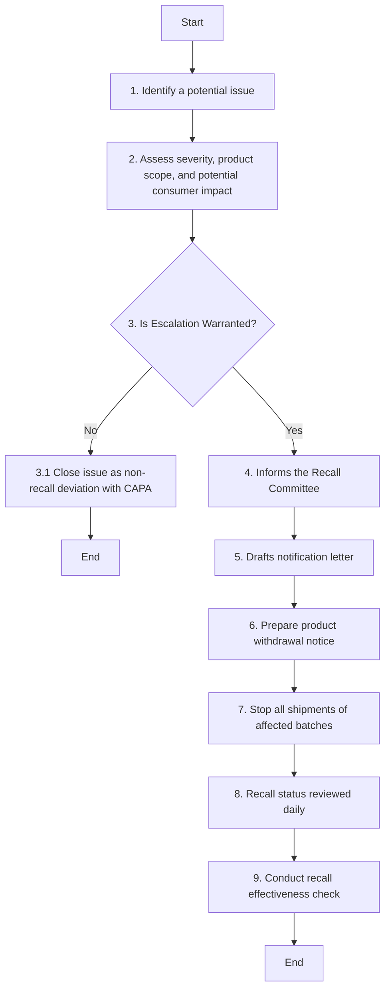

### Analysis of the Flowchart

#### 1. Process Name
- **Product Recall / Return**

#### 2. Roles (Swimlanes)
- QA
- Regulatory Affairs Officer

#### 3. Steps in Markdown Table

| Step # | Role                    | Action                                                                                 | Next Step/Logic                           |
|--------|-------------------------|----------------------------------------------------------------------------------------|-------------------------------------------|
| 1      | QA                      | Identifies a potential issue. Logs incident in SAP QM and initiates internal investigation. | 2                                         |
| 2      | QA                      | Assess severity, product scope, and potential consumer impact.                         | 3                                         |
| 3      | QA                      | Is Escalation Warranted?                                                               | Yes: 4, No: 3.1                           |
| 3.1    | QA                      | Close issue as non-recall deviation with CAPA.                                         | End                                       |
| 4      | Regulatory Affairs Officer | Informs the Recall Committee. Formal Recall Decision Form is initiated. Risk assessment report is completed. | 5                                         |
| 5      | Regulatory Affairs Officer | Drafts notification letter. Notify SFDA or other relevant authority. Provide traceability, quantity affected, and risk details. | 6                                         |
| 6      | QA                      | Prepare product withdrawal notice. Communicate via email, phone, or official letters. Record acknowledgment. | 7                                         |
| 7      | QA                      | Stop all shipments of affected batches. Quarantine available stock. Coordinate with customers and record returned quantities. | 8                                         |
| 8      | QA                      | Recall status reviewed daily. Any delays, non-cooperation, or serious findings are escalated to CEO. | 9                                         |
| 9      | Regulatory Affairs Officer | Conduct recall effectiveness check. Prepare and Submit report to SFDA and archive per retention policy. | End                                       |

#### 4. Mermaid.js Code Block

