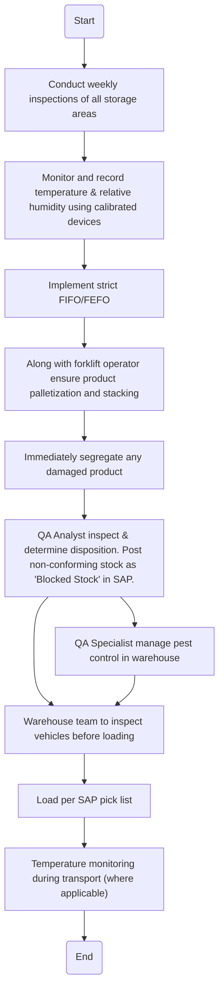

### Analysis

1. **Process Name**
   - Quality Assurance of Storage of Finished Product

2. **Roles (Swimlanes)**
   - Warehouse Section Head
   - QA
   - Transport Contractor

3. **Markdown Table**

| Step # | Role                  | Action                                                                                  | Next Step/Logic                                       |
|--------|-----------------------|-----------------------------------------------------------------------------------------|-------------------------------------------------------|
| 1      | Warehouse Section Head| Conduct weekly inspections of all storage areas                                         | Step 2                                                |
| 2      | Warehouse Section Head| Monitor and record temperature & relative humidity using calibrated devices              | Step 3                                                |
| 3      | Warehouse Section Head| Implement strict FIFO/FEFO                                                               | Step 4                                                |
| 4      | Warehouse Section Head| Along with forklift operator ensure product palletization and stacking                  | Step 5                                                |
| 5      | Warehouse Section Head| Immediately segregate any damaged product                                               | Step 6                                                |
| 6      | QA                    | QA Analyst inspect & determine disposition. Post non-conforming stock as "Blocked Stock" in SAP. | Step 7, Step 8                                        |
| 7      | QA                    | QA Specialist manage pest control in warehouse                                          | Step 9                                                |
| 8      | Warehouse Section Head| Warehouse team to inspect vehicles before loading                                       | Step 10                                               |
| 9      | Transport Contractor  | Load per SAP pick list                                                                   | Step 11                                               |
| 10     | Transport Contractor  | Temperature monitoring during transport (where applicable)                               | End                                                   |

4. **Mermaid.js Code Block**

