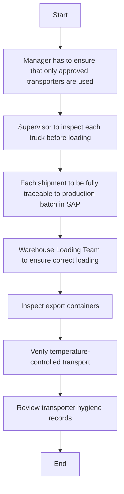

1. **Process Name:** Quality Assurance of Storage of Finished Product

2. **Roles (Swimlanes):**
   - Logistics
   - Loading Team
   - Export Manager
   - QA Analyst
   - Procurement

3. **Markdown Table:**

| Step # | Role          | Action                                              | Next Step/Logic                                       |
|--------|---------------|-----------------------------------------------------|-------------------------------------------------------|
| 1      | Logistics     | Manager has to ensure that only approved transporters are used | 2                                                     |
| 2      | Logistics     | Supervisor to inspect each truck before loading     | 3                                                     |
| 3      | Logistics     | Each shipment to be fully traceable to production batch in SAP  | 4                                                     |
| 4      | Loading Team  | Warehouse Loading Team to ensure correct loading    | 5                                                     |
| 5      | Export Manager| Inspect export containers                           | 6                                                     |
| 6      | QA Analyst    | Verify temperature-controlled transport             | 7                                                     |
| 7      | Procurement   | Review transporter hygiene records                  | End                                                   |

4. **Mermaid.js Code Block:**

