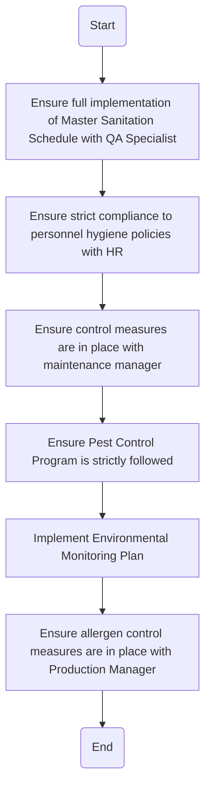

### Analysis of the Flowchart

1. **Process Name:**
   - Finished Products: Food Safety & Contamination Control

2. **Roles (Swimlanes):**
   - Production Supervisor
   - QA Manager
   - QA Specialist

3. **Steps in a Markdown Table:**

| Step # | Role               | Action                                                                            | Next Step/Logic                                                       |
|--------|--------------------|-----------------------------------------------------------------------------------|-----------------------------------------------------------------------|
| 1      | Production Supervisor | Ensure full implementation of Master Sanitation Schedule with QA Specialist    | Go to Step 2                                                          |
| 2      | QA Manager         | Ensure strict compliance to personnel hygiene policies with HR                    | Go to Step 3                                                          |
| 3      | QA Manager         | Ensure control measures are in place with maintenance manager                      | Go to Step 4                                                          |
| 4      | QA Manager         | Ensure Pest Control Program is strictly followed                                   | Go to Step 5                                                          |
| 5      | QA Specialist      | Implement Environmental Monitoring Plan                                           | Go to Step 6                                                          |
| 6      | QA Specialist      | Ensure allergen control measures are in place with Production Manager              | End                                                                   |

4. **Mermaid.js Code Block:**

This structured format and code block provides a clear understanding of the flowchart and can be used for further process automation and visualization.