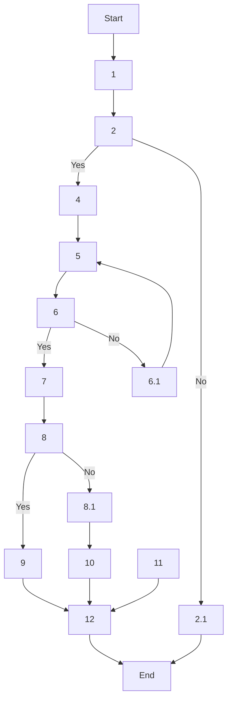

### 1. Process Name
Microbiological Risk Management

### 2. Roles (Swimlanes)
- M
- QA
- A
- HR/QA

### 3. Steps in Markdown Table

| Step # | Role  | Action                                                                                   | Next Step/Logic                                 |
|--------|-------|------------------------------------------------------------------------------------------|-------------------------------------------------|
| 1      | M     | Samples each lot of wheat and key additives. External lab or in-house microbiological testing. | 2                                               |
| 2      | M     | Results within limits?                                                                   | Yes: 4 / No: 2.1                                |
| 2.1    | M     | Reject/segregate and initiate NCR                                                        | End                                             |
| 3      | M     | Testing Water used in processing. Ensure compliance with potable water standards.         | 4                                               |
| 4      | A/M   | Monthly swabbing of equipment contact surfaces, air quality, personnel hygiene, target limits. | 5                                               |
| 5      | A     | Cleaning & Sanitation SOPs followed for verification via swabs post-cleaning              | 6                                               |
| 6      | A     | Swab results within limits?                                                              | Yes: 7 / No: 6.1                                |
| 6.1    | M     | Re-clean and retest before use                                                           | 5                                               |
| 7      | A/M   | Each batch sampled and sent for full micro panel. Reviews results before Usage Decision (UD) in SAP | 8                                               |
| 8      | A/M   | Results within limits?                                                                   | Yes: 9 / No: 8.1                                |
| 8.1    | M     | Block in SAP, conduct RCA                                                                | 10                                              |
| 9      | M     | Conducts internal drills to test                                                         | 12                                              |
| 10     | A     | NCR raised in SAP QM. Batch isolated. RCA + CAPA documented.                             | 12                                              |
| 11     | M     | Annual microbiological risk training. Training records maintained in HR LMS              | 12                                              |
| 12     | A/M   | All test results, swab reports, and CAPAs recorded and retained ≥ 5 years                | End                                             |

### 4. Logic in Mermaid.js Code Block

