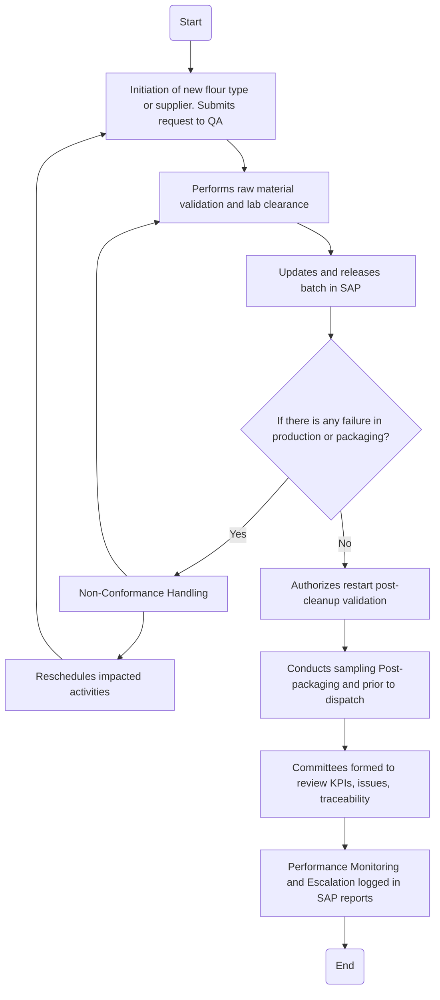

### 1. Process Name
Governance Framework for Cross-Functional Collaboration

### 2. Roles (Swimlanes)
- Production
- QA
- Supply Chain
- Maintenance

### 3. Steps in Markdown Table

```markdown
| Step # | Role        | Action                                                      | Next Step/Logic                                     |
|--------|-------------|-------------------------------------------------------------|-----------------------------------------------------|
| 1      | Production  | Initiation of new flour type or supplier. Submits request to QA | Step 2                                              |
| 2      | QA          | Performs raw material validation and lab clearance          | Step 3                                              |
| 3      | Supply Chain| Updates and releases batch in SAP                           | Step 4                                              |
| 4      | Maintenance | If there is any failure in production or packaging. Logs downtime. | Step 5 or Step 6                                    |
| 5      | QA          | Non-Conformance Handling                                    | Step 2                                              |
| 6      | QA          | Authorizes restart post-cleanup validation                  | Step 7                                              |
| 7      | QA          | Conducts sampling Post-packaging and prior to dispatch      | Step 8                                              |
| 8      | QA          | Committees formed to review KPIs, issues, traceability      | Step 9                                              |
| 9      | QA          | Performance Monitoring and Escalation logged in SAP reports | End                                                 |
| 10     | Production  | Reschedules impacted activities                             | Step 1                                              |
```

### 4. Logic in Mermaid.js Code Block



This representation covers the flowchart logic and traces all decision paths accurately.