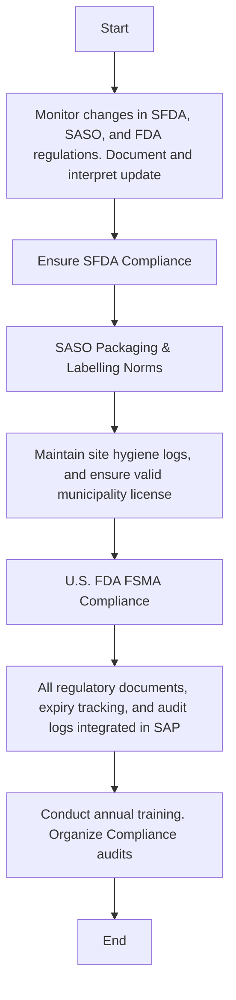

### Analysis of the Flowchart

1. **Process Name:** Regulatory Compliance

2. **Roles (Swimlanes):**
   - Regulatory Affairs Officer
   - QA
   - Facilities Manager
   - Export Compliance Officer

3. **Steps Extracted into Markdown Table:**

| Step # | Role                     | Action                                                                       | Next Step/Logic                                |
|--------|--------------------------|----------------------------------------------------------------------------|------------------------------------------------|
| 1      | Regulatory Affairs Officer | Monitor changes in SFDA, SASO, and FDA regulations. Document and interpret update | Ensure SFDA Compliance (Step 2)                  |
| 2      | QA                        | Ensure SFDA Compliance                                                      | SASO Packaging & Labelling Norms (Step 3)       |
| 3      | QA                        | SASO Packaging & Labelling Norms                                            | Maintain site hygiene logs (Step 4)             |
| 4      | Facilities Manager       | Maintain site hygiene logs, and ensure valid municipality license           | U.S. FDA FSMA Compliance (Step 5)               |
| 5      | Export Compliance Officer| U.S. FDA FSMA Compliance                                                    | All regulatory documents integrated in SAP (Step 6) |
| 6      | Regulatory Affairs Officer | All regulatory documents, expiry tracking, and audit logs integrated in SAP| Conduct annual training (Step 7)                |
| 7      | Regulatory Affairs Officer | Conduct annual training. Organize Compliance audits                        | End                                             |

4. **Mermaid.js Code Block:**

This representation details the roles and actions involved in maintaining regulatory compliance in a structured way.