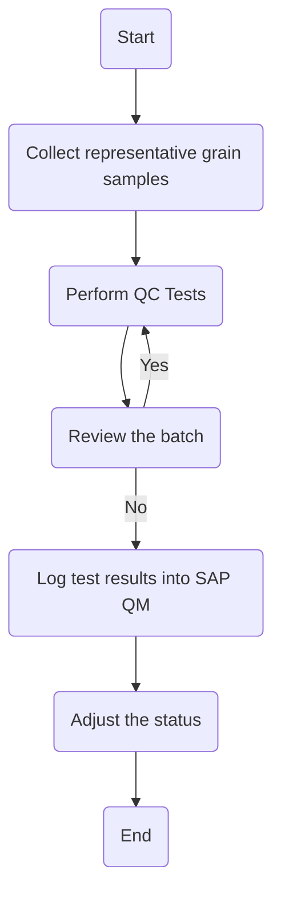

1. **Process Name**: Raw Wheat Receipt into Silos

2. **Roles (Swimlanes)**:
   - QA Analyst
   - Data Entry Operator

3. **Steps in Markdown Table**:

| Step # | Role              | Action                                | Next Step/Logic           |
|--------|-------------------|---------------------------------------|---------------------------|
| 1      | QA Analyst        | Start                                 | Step 2                    |
| 2      | QA Analyst        | Collect representative grain samples  | Step 3                    |
| 3      | QA Analyst        | Perform QC Tests                      | Step 4                    |
| 4      | QA Analyst        | Review the batch                      | Step 5: Quarantine/Rejected? |
| 5      | QA Analyst        | Quarantine/Rejected?                  | Yes: Step 3, No: Step 6   |
| 6      | Data Entry Operator | Log test results into SAP QM         | Step 7                    |
| 7      | Data Entry Operator | Adjust the status                    | Step 8                    |
| 8      | Data Entry Operator | End                                  |                           |

4. **Mermaid.js Code Block**:

