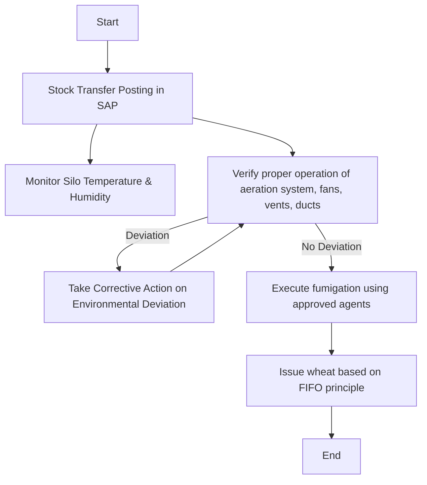

### 1. Process Name

Raw Wheat Receipt into Silos

### 2. Roles (Swimlanes)

- Silo Operator
- Mechanic
- QA Analyst
- Distribution Center Specialist

### 3. Steps in Markdown Table

| Step # | Role                        | Action                                                       | Next Step/Logic                                          |
|--------|-----------------------------|--------------------------------------------------------------|----------------------------------------------------------|
| 1      | Silo Operator               | Start                                                        | Step 2                                                   |
| 2      | Silo Operator               | Stock Transfer Posting in SAP                                | Step 3, 4                                                |
| 3      | Mechanic                    | Monitor Silo Temperature & Humidity                          | Step 4                                                   |
| 4      | Silo Operator               | Verify proper operation of aeration system, fans, vents, ducts | If deviation, Step 5; Else, Step 6                       |
| 5      | Silo Operator               | Take Corrective Action on Environmental Deviation             | Step 4                                                   |
| 6      | QA Analyst                  | Execute fumigation using approved agents                      | Step 7                                                   |
| 7      | Distribution Center Specialist | Issue wheat based on FIFO principle                          | End                                                      |

### 4. Mermaid.js Code Block

