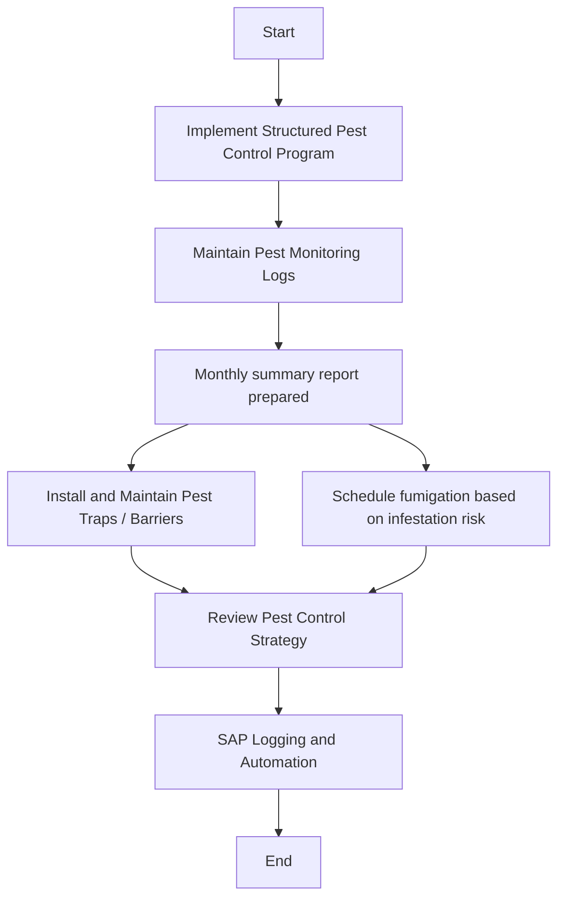

### 1. Process Name
- Raw Wheat Receipt into Silos - Pest Management Monitoring

### 2. Roles (Swimlanes)
- QA
- Silo Operator
- Data Entry Operator

### 3. Steps in Markdown Table

| Step # | Role               | Action                                               | Next Step/Logic                                          |
|--------|--------------------|------------------------------------------------------|----------------------------------------------------------|
| 1      | QA                 | Start                                                | Implement Structured Pest Control Program                |
| 2      | QA                 | Implement Structured Pest Control Program            | Maintain Pest Monitoring Logs                            |
| 3      | Silo Operator      | Maintain Pest Monitoring Logs                        | Monthly summary report prepared                          |
| 4      | QA                 | Monthly summary report prepared                      | Install and Maintain Pest Traps / Barriers / Schedule fumigation based on infestation risk |
| 5      | QA                 | Install and Maintain Pest Traps / Barriers           | Review Pest Control Strategy   |
| 6      | QA                 | Schedule fumigation based on infestation risk        | Review Pest Control Strategy                                       |
| 7      | Data Entry Operator| Review Pest Control Strategy                         | SAP Logging and Automation                               |
| 8      | Data Entry Operator| SAP Logging and Automation                           | End                                                      |

### 4. Logic in Mermaid.js Code Block

