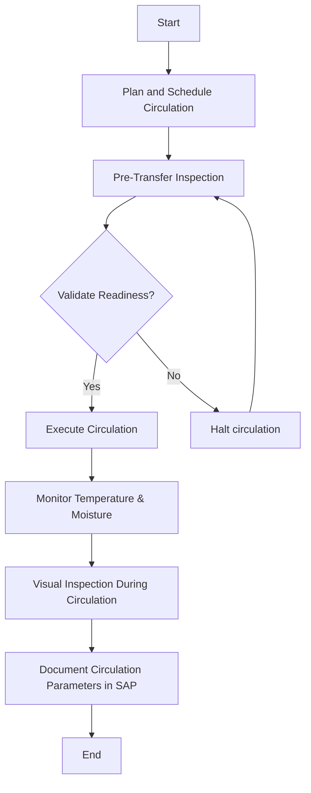

### Analysis of Flowchart

1. **Process Name:**
   - Raw Wheat Receipt into Silos

2. **Roles (Swimlanes):**
   - Silo Operator
   - QA Analyst

3. **Steps in Markdown Table:**

   | Step # | Role         | Action                                      | Next Step/Logic                                      |
   |--------|--------------|---------------------------------------------|------------------------------------------------------|
   | 1      | Silo Operator| Start                                       | Step 2                                               |
   | 2      | Silo Operator| Plan and Schedule Circulation               | Step 3                                               |
   | 3      | Silo Operator| Pre-Transfer Inspection                     | Step 4                                               |
   | 4      | Silo Operator| Validate Readiness?                         | Yes: Step 5 No: Step 6                            |
   | 5      | Silo Operator| Execute Circulation                         | Step 7                                               |
   | 6      | Silo Operator| Halt circulation                            | Step 3                                               |
   | 7      | QA Analyst   | Monitor Temperature & Moisture              | Step 8                                               |
   | 8      | QA Analyst   | Visual Inspection During Circulation        | Step 9                                               |
   | 9      | Silo Operator| Document Circulation Parameters in SAP      | Step 10                                              |
   | 10     | Silo Operator| End                                         | -                                                    |

4. **Mermaid.js Code Block:**

