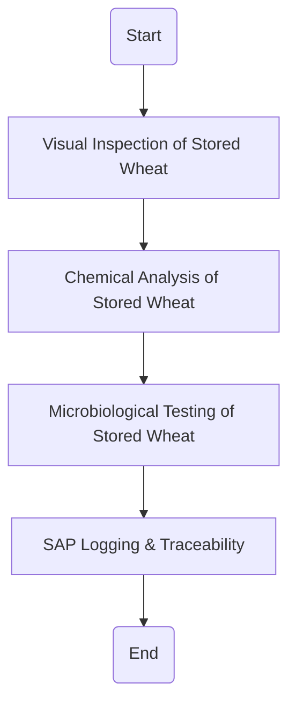

### Analysis of the Flowchart

1. **Process Name**: Raw Wheat Receipt into Silos

2. **Roles (Swimlanes)**:
   - Silo Operator
   - QA Analyst
   - Data Entry Operator

3. **Steps in Markdown Table**:

| Step # | Role               | Action                                  | Next Step/Logic                                     |
|--------|--------------------|-----------------------------------------|-----------------------------------------------------|
| 1      | Silo Operator      | Visual Inspection of Stored Wheat       | Proceed to Chemical Analysis of Stored Wheat        |
| 2      | QA Analyst         | Chemical Analysis of Stored Wheat       | Proceed to Microbiological Testing of Stored Wheat  |
| 3      | QA Analyst         | Microbiological Testing of Stored Wheat | Proceed to SAP Logging & Traceability               |
| 4      | Data Entry Operator| SAP Logging & Traceability              | End                                                 |

4. **Mermaid.js Code Block**:

