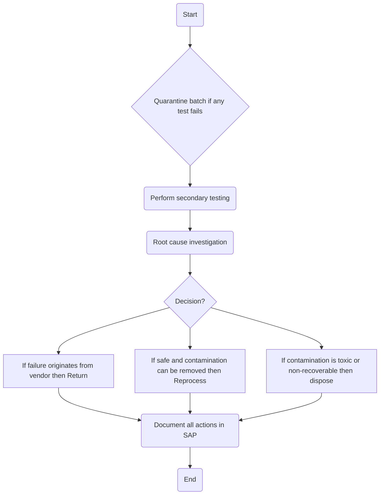

### Analysis of Flowchart

1. **Process Name:** Raw Wheat Receipt into Silos - Quarantine & Rejection Handling

2. **Roles (Swimlanes):**
   - QA Analyst
   - QA Specialist
   - Department Manager
   - Data Entry Operator

3. **Steps in Markdown Table:**

| Step # | Role                | Action                                                    | Next Step/Logic                                              |
|--------|---------------------|-----------------------------------------------------------|--------------------------------------------------------------|
| 1      | QA Analyst          | Start                                                     | Quarantine batch if any test fails                           |
| 2      | QA Analyst          | Quarantine batch if any test fails                        | Perform secondary testing                                    |
| 3      | QA Specialist       | Perform secondary testing                                 | Root cause investigation                                     |
| 4      | QA Specialist       | Root cause investigation                                  | Decision?                                                    |
| 5      | Department Manager  | Decision?                                                 | If failure originates from vendor -> Return; If safe -> Reprocess; If toxic -> Dispose |
| 6      | Department Manager  | If failure originates from vendor then Return             | Document all actions in SAP                                  |
| 7      | Department Manager  | If safe and contamination can be removed then Reprocess   | Document all actions in SAP                                  |
| 8      | Department Manager  | If contamination is toxic or non-recoverable then dispose | Document all actions in SAP                                  |
| 9      | Data Entry Operator | Document all actions in SAP                               | End                                                          |

4. **Mermaid.js Code Block:**

