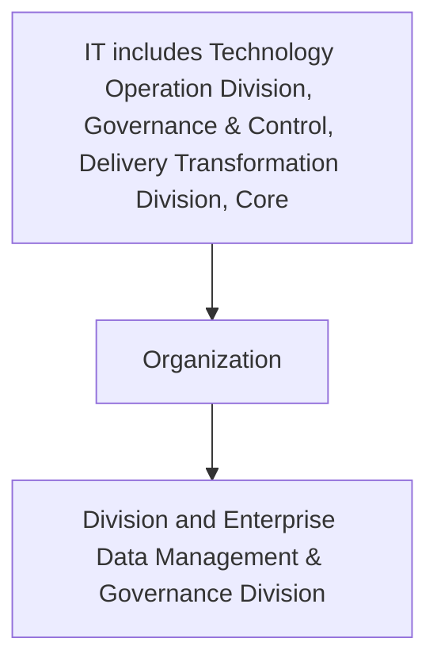

## .4. Reference and Master Data Management KPIs

It is important to measure and analyze the coverage, accuracy and efficiency of Reference and Master Data management. The following table delineates the data classification key performance indicators.

| Category | Metric | Description |
| --- | --- | --- |
| Reference / Master data Identification | Number of master datasets | Total number of datasets identified as Master Datasets |
| Reference / Master data Identification | Number of Reference datasets | Total number of datasets identified as Reference Datasets |
| Reference / Master data Profiling | % of Profiled Reference/ Master Datasets | Percentage of datasets profiled as Reference / Master Datasets |
| Reference / Master data process efficiency | Number of Reference/Master Datasets updated in past 12 months | Updates made to master and/or reference datasets in last 12 months. |
| Reference / Master data process efficiency | Number of incorrect data values in the Reference / Master Data Records | Incorrect values identified in the Reference / Master Data Records. This should be a downward trend with the passage of time |
| Reference / Master data process efficiency | Number of Data Quality Issues identified in Reference/Master Datasets | Data quality issues identified within the Reference / Master Data Records and/or datasets. This should be a downward trend with the passage of time |
| Reference / Master data process efficiency | Number of Change Requests for Reference/Master Dataset(s) | Change requests made for Reference/Master Dataset(s). This will describe the frequency of changes made within Reference/Master Dataset(s) |


**[Flowchart — Word Shapes]:**

1. IT* includes Technology Operation Division, Governance & Control, Delivery Transformation Division, Core
2. Organization
3. ing
4. Division and Enterprise Data Management & Governance Division
5. ing Division and Enterprise Data Management & Governance Division


**[Flowchart — Structured]:**

```markdown
### Step Table

| Step | Description                                                                                                                                           |
|------|-------------------------------------------------------------------------------------------------------------------------------------------------------|
| 1    | IT includes Technology Operation Division, Governance & Control, Delivery Transformation Division, Core                                               |
| 2    | Organization                                                                                                                                          |
| 3    | IT includes Technology Operation Division, Governance & Control, Delivery Transformation Division, Core Organization, Division and Enterprise Data Management & Governance Division  |

### Mermaid Diagram


```