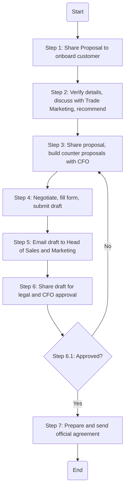

## Analysis

### 1. Identify the 'Process Name':
- **Other Customer Procedure**

### 2. Identify all 'Roles' (Swimlanes):
- Sales Manager/Analyst
- B2C Sales Director
- CFO

### 3. Extract every step into a Markdown table:

| Step # | Role                | Action                                                                                                                | Next Step/Logic  |
|--------|---------------------|-----------------------------------------------------------------------------------------------------------------------|------------------|
| 1      | Sales Manager/Analyst | Shares the Proposal to onboard customer. (M)                                                                          | Step 2           |
| 2      | B2C Sales Director  | Verify all details through its own sources, discuss it with Trade Marketing manager and share recommendation for the agreement negotiations and consensus. (M) | Step 3           |
| 3      | B2C Sales Director  | Share sales proposal and recommended consensus, build counter proposals with CFO for review. (M)                      | Step 4           |
| 4      | Sales Manager/Analyst | Negotiate proposal with customer. Upon verbal agreement, Fill standard agreement form with required data and submit draft agreement to Sales Analyst. (M) | Step 5           |
| 5      | Sales Manager/Analyst | Email draft agreement to Head of Sales, and Head of Marketing for their review and approval. (M)                      | Step 6           |
| 6      | Sales Manager/Analyst | After Sales and Marketing approval, shares draft agreement to Head of legal and CFO for review and approval. (M)      | Decision 6.1     |
| 6.1    | -                   | Approved?                                                                                                              | Yes: Step 7 No: Step 4 |
| 7      | Sales Manager/Analyst | Prepare official agreement and send it to relevant Sales team for customer approval. Sales team will collect and submit signed agreement. (M) | End              |

### 4. Provide the logic as a Mermaid.js code block:

