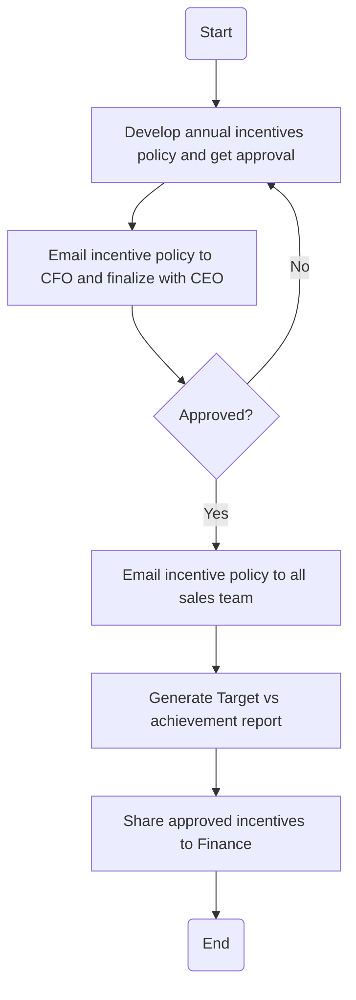

### Analysis of the Flowchart

#### 1. Process Name
- **Incentive Procedure**

#### 2. Roles (Swimlanes)
- **Sales**
- **CEO**

#### 3. Steps in Markdown Table

| Step # | Role  | Action                                                                                                                 | Next Step/Logic                      |
|--------|-------|------------------------------------------------------------------------------------------------------------------------|--------------------------------------|
| 1      | Sales | Develop annual incentives policy for their respective divisions for next fiscal year and share with Head of Sales for approval (M).  | Step 2                               |
| 2      | CEO   | After approval, Head of Sales will email incentive policy to CFO for approval. Once approved by CFO, it is forwarded to CEO for finalization (M). | Step 2.1                            |
| 2.1    | CEO   | Approved?                                                                                                               | Yes: Step 3 / No: Step 1             |
| 3      | Sales | Sales Analyst will email incentive policy to all sales team (M).                                                        | Step 4                               |
| 4      | Sales | Sales Analyst will generate Target vs achievement report from Sales analytics software and develop Incentives (M).     | Step 5                               |
| 5      | Sales | Sales Analyst shares approved incentives to Finance for further process and CEO approval (M).                          | End                                  |

#### 4. Logic as Mermaid.js Code Block

