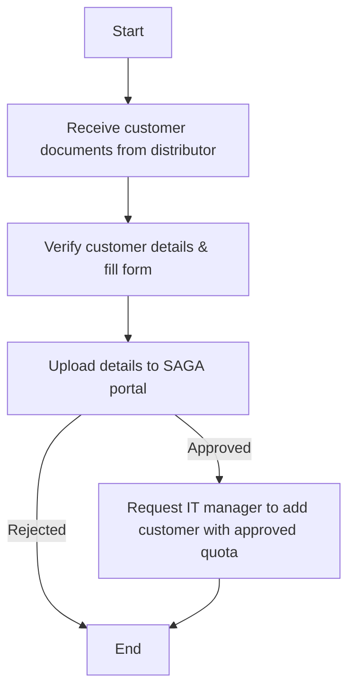

### Flowchart Analysis

1. **Process Name**: B2B Customer Onboarding

2. **Roles (Swimlanes)**:
   - Branch Sales Manager
   - Sales Analyst

3. **Steps (Markdown Table)**:

| Step # | Role                | Action                                                                                                                                       | Next Step/Logic                 |
|--------|---------------------|----------------------------------------------------------------------------------------------------------------------------------------------|---------------------------------|
| 1      | Branch Sales Manager | Receives the customer documents such as CR, License, existing quota, and other business documents from distributor.                        | Step 2                          |
| 2      | Branch Sales Manager | Visit and verify all details of the customer, fill the standard form with all required details, and share it with B2B Sales Director.       | Step 3                          |
| 3      | Sales Analyst       | Upload all customer details and documents in the SAGA portal. SAGA will either approve or reject it.                                         | Step 4 if approved, otherwise ends here |
| 4      | Sales Analyst       | After SAGA approval, Sales Analyst will ask IT manager to add customer in distributor account with approved monthly quota.                   | End                             |

4. **Mermaid.js Code Block**:

