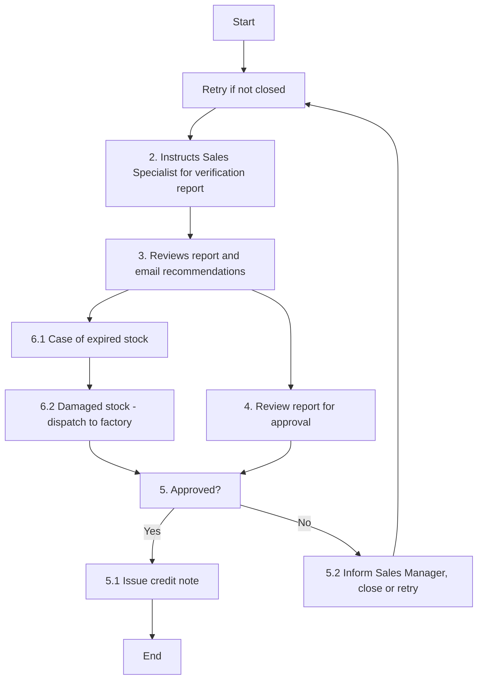

### Analysis of Flowchart

#### 1. Process Name
- Sales Returns

#### 2. Roles (Swimlanes)
- Branch Sales Manager
- Sales Director
- Finance Manager

#### 3. Extracted Steps

| Step # | Role               | Action                                                                                     | Next Step/Logic            |
|--------|--------------------|--------------------------------------------------------------------------------------------|----------------------------|
| 1      | Branch Sales Manager  | Receives a request for stock return along with reasons, pictures, and quantities details from customer. (A) | Step 2                     |
| 2      | Branch Sales Manager  | Instructs the relevant Sales Specialist to prepare a brief stock verification and root cause analysis report. (M) | Step 3                     |
| 3      | Branch Sales Manager  | Reviews report and emails it with recommendations to relevant Sales Director keeping Sales Analyst in loop for coordination. (M) | Step 4 or Step 6.1         |
| 4      | Sales Director     | Reviews report along with Sales Analyst and shares it with Finance Manager, Trade Marketing Manager, and Quality Manager for review and approval. (M) | Step 5                     |
| 5      | Sales Director     | **Approved?**                                                                               | Yes: Step 5.1 / No: Step 5.2 |
| 5.1    | Sales Director     | Issue credit note and share it with Sales Analyst which will be emailed to the customer. (A) | End                        |
| 5.2    | Finance Manager    | Inform Sales Manager and either close the process or move to step 1                            | Step 1 if not closed       |
| 6.1    | Branch Sales Manager  | Collect documentary evidence, submit it to Sales Analyst and Finance Manager in case of expired stock. (M) | End (following Step 6.2)  |
| 6.2    | Branch Sales Manager  | In case of damaged stock, if Quality Manager approved it for return and repacking, stock will be dispatched to Warehouse/Factory. (M) | End                        |

#### 4. Mermaid.js Code Block

