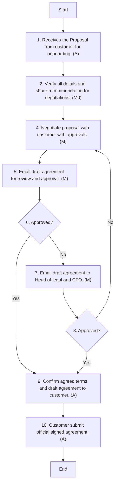

### Analysis

1. **Process Name:**
   - B2C-Modern Trade

2. **Roles (Swimlanes):**
   - Key Accounts Manager
   - B2C Sales Director
   - Trade Marketing Manager
   - Sales and Marketing
   - CFO

3. **Steps:**

| Step # | Role                  | Action                                                                                                 | Next Step/Logic  |
|--------|-----------------------|--------------------------------------------------------------------------------------------------------|------------------|
| 1      | Key Accounts Manager  | Receives the proposal from customer for onboarding. (A)                                                | Step 2           |
| 2      | Key Accounts Manager  | Verify all details and share recommendations for agreement negotiations and consensus building. (M0)   | Step 4           |
| 3      | B2C Sales Director    | Share customer proposal and recommended counter proposals with CFO for review. (M)                     | Step 4           |
| 4      | Key Accounts Manager  | Negotiate proposal with customer along with Trade Marketing Manager as per approval from B2C Sales Director and CFO. (M) | Step 5 |
| 5      | Trade Marketing Manager | Email draft agreement to Head of Sales, Director B2C Sales, and Head of Marketing for their review and approval. (M) | Step 6           |
| 6      | Sales and Marketing   | Approved?                                                                                               | Yes: Step 9 / No: Step 7 |
| 7      | Trade Marketing Manager | Email draft agreement to Head of Legal and CFO for review. CFO will review and suggest amendments or approve it. (M) | Step 8           |
| 8      | CFO                   | Approved?                                                                                               | Yes: Step 9 / No: Step 4 |
| 9      | Key Accounts Manager  | Confirm agreed terms and draft agreement to the customer via email and ask for an official signed agreement for further process. (A) | Step 10          |
| 10     | Key Accounts Manager  | Customer submits official signed agreement along with required documentation. Document officially signed by Head of Sales. (A) | End              |

4. **Mermaid.js Code:**

This code block represents the logic of the flowchart and captures all the steps, roles, and decision paths within the process.