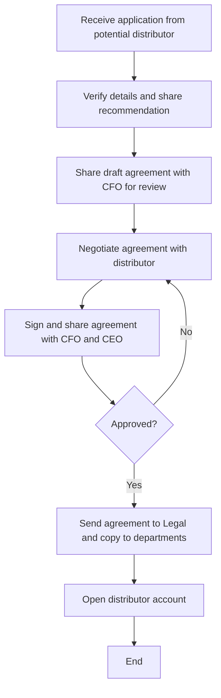

### Analysis

1. **Process Name**: B2B-Distributor
2. **Roles (Swimlanes)**:
   - Branch Sales Manager
   - B2C Sales Director
   - CEO
   - IT Manager

3. **Steps**:

| Step # | Role              | Action                                                                                                         | Next Step/Logic |
|--------|-------------------|----------------------------------------------------------------------------------------------------------------|-----------------|
| 1      | Branch Sales Manager | Receive formal application from potential distributor for onboarding. (A)                                     | Step 2          |
| 2      | B2C Sales Director | Verify details and share recommendation for onboarding and negotiations. (M)                                   | Step 3          |
| 3      | B2C Sales Director | Share draft agreement with CFO for review. (M)                                                                 | Step 4          |
| 4      | B2C Sales Director | Negotiate agreement with distributor; signed agreement submitted to B2C Sales Director. (M)                    | Step 5          |
| 5      | CEO               | Sign and share agreement with CFO and CEO for review and approval. (M)                                          | Step 5.1        |
| 5.1    | CEO               | Approved?                                                                                                       | Yes: Step 5.1.1 No: Back to Step 4 |
| 5.1.1  | CEO               | Agreement sent to Legal and copied to Finance, IT, B2C Sales Director, Sales Analyst. (A)                        | Step 6          |
| 6      | IT Manager        | Open distributor account per customer details and agreement. (M)                                               | End             |

4. **Mermaid.js Code**:

- **Decision paths are traced explicitly**: If "Approved?" is "No," it returns to Step 4 (negotiation). If "Yes," it proceeds to send the agreement to relevant departments.