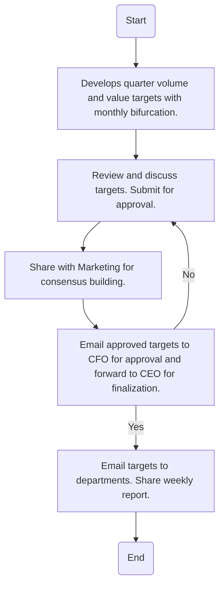

### Analysis

1. **Process Name:**
   - Sales Target Setting

2. **Roles (Swimlanes):**
   - B2C Sales Director
   - Branch Sales Manager
   - CEO
   - Sales Analyst

3. **Steps Table:**

| Step # | Role                   | Action                                                                                     | Next Step/Logic          |
|--------|------------------------|--------------------------------------------------------------------------------------------|--------------------------|
| 1      | B2C Sales Director     | Develops quarter volume and value targets with monthly bifurcation.                         | Step 2                   |
| 2      | Branch Sales Manager   | Review and discuss targets with his team. Submit it to B2C Sales Director and Sales Analyst for approval. | Step 3                   |
| 3      | B2C Sales Director     | Share with Marketing via email approved Sales targets and have meeting for consensus building. | Step 4                   |
| 4      | B2C Sales Director     | Email approved quarter and monthly targets to CFO for approval. Once approved by CFO it is forwarded to CEO for finalization. | Decision: Approved?         |
| 5      | CEO                    | Approved?                                                                                  | Yes: Step 6 / No: Step 2 |
| 6      | Sales Analyst          | Email targets to all departments and branch sales manager. Share weekly report with B2C Sales Director and Branch Sales Manager. | End                      |

4. **Mermaid.js Code Block:**

This flowchart outlines the detailed process of setting sales targets, with approval stages and departmental communication highlighted clearly.