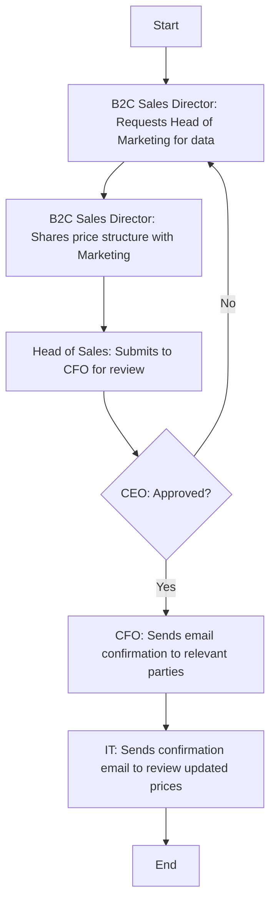

### Analysis

#### 1. Process Name:
- Price Setting

#### 2. Roles (Swimlanes):
- B2C Sales Director
- Head of Sales
- CEO
- CFO
- IT

#### 3. Steps in Markdown Table:

| Step # | Role              | Action                                                                                                                                         | Next Step/Logic        |
|--------|-------------------|------------------------------------------------------------------------------------------------------------------------------------------------|------------------------|
| 1      | B2C Sales Director| Requests Head of Marketing for arranging retail audit data from research agencies. Also collects market and competitors’ data.                  | Step 2                 |
| 2      | B2C Sales Director| Shares recommended price structure, if changes required, with Head of Marketing for review.                                                    | Step 3                 |
| 3      | Head of Sales     | Price structure is submitted to CFO for review. If Prices are approved by CFO, it is submitted to CEO for final approval.                       | Decision 3.1           |
| 3.1    | CEO               | Approved?                                                                                                                                      | Yes: Step 4, No: Step 1|
| 4      | CFO               | Sends an email confirmation to the Head of Sales, B2C Sales Director, IT and Head of Marketing for record keeping.                              | Step 5                 |
| 5      | IT                | Sends a confirmation email to the B2C Sales Director and Sales Analyst/Coordinator to verify and review the updated prices.                     | End                    |

#### 4. Logic in Mermaid.js Code Block:

This flowchart represents a structured process for setting prices with approval loops and communication between departments for confirmation and verification.