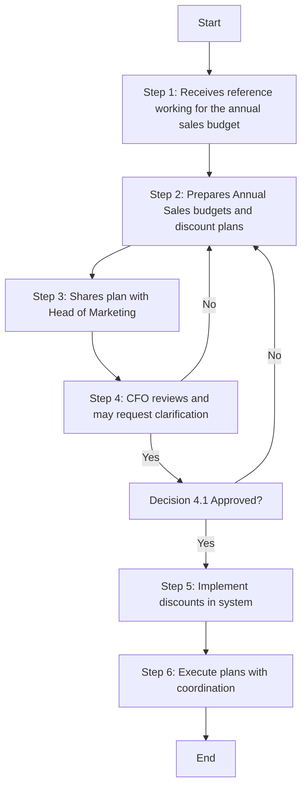

### Analysis

1. **Process Name**: Sales Budgets and Discounts

2. **Roles (Swimlanes)**:
   - Sales
   - CFO
   - CEO
   - IT Manager

3. **Steps in Markdown Table**:

| Step # | Role       | Action                                                                 | Next Step/Logic  |
|--------|------------|------------------------------------------------------------------------|------------------|
| 1      | Sales      | Receives reference working for the annual sales budget from CFO or Financial Planning Analyst (A) | Step 2           |
| 2      | Sales      | Develops sales plan and prepares Annual Sales budgets and discount plans (M) | Step 3           |
| 3      | Sales      | Shares the plan with Head of Marketing to discuss and align (M)         | Step 4           |
| 4      | CFO        | After internal review, CFO may request clarification from Sales team and shares with CEO for approval (M) | Decision 4.1    |
| 4.1    | CEO        | Approval decision                                                      | Step 5 if Yes/Step 2 if No |
| 5      | IT Manager | Implement discounts in the system and inform Sales director and Analyst for confirmation (M) | Step 6           |
| 6      | Sales      | Execute plans in coordination with Marketing, Trade Marketing, and Finance (M) | End              |

4. **Logic in Mermaid.js**:

This flowchart outlines the process of preparing and approving sales budgets and discounts, involving collaboration between the Sales, CFO, CEO, and IT Manager roles, with built-in decision points for approval.