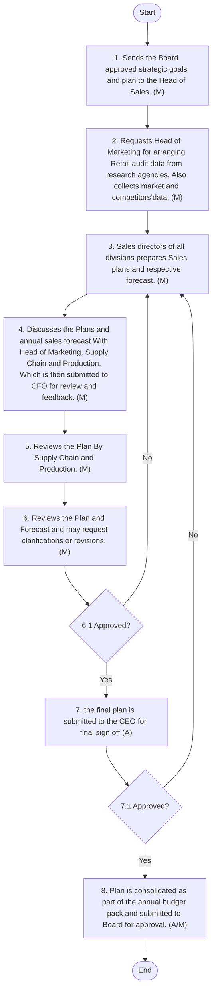

## Sales Planning & Forecast

#### Policy Statement
Sales planning and forecasting are pivotal functions of the Sales Department, directly influencing the Company's revenue targets. These activities shall be derived from the overarching business strategy and annual goals.
The policy shall ensure a structured and data-driven approach by incorporating cross-functional insights, particularly from the Marketing department, and by establishing alignment with Senior Management before final approvals.
 The CEO shall share strategic goals and plans with the Board of Directors by September of the ongoing fiscal year to guide the planning cycle for the next fiscal year.
 Once approved by the Board, the Sales Department shall prepare the annual sales plan and forecast accordingly.
 The forecasting shall be prepared considering market and category insights, including Retail audit data, to assess market trends, customer behaviour, avenues of growth, and potential gaps.
 The finalised sales forecast and annual plans shall be approved by Senior Management before the start of the fiscal year.
 New Products/Brands sales plans and forecasts shall be developed and shared separately from those of existing brands.
 The Company shall also focus primarily on volumetric growth, along with value growth.
 The sales forecasting process shall be performed using technology to the maximum extent possible. The Sales Promotional Calendar shall also be aligned with the Annual Marketing and Trade Marketing plans where applicable.
 Department and individual KPIs shall be developed using the SMART framework (i.e., Specific, Measurable, Achievable, Relevant, and Time-bound) to ensure effective performance management.
 In the first week of every quarter, a Management Committee Meeting (MCM), comprising all Department Heads and the CEO, shall be convened to review the previous quarter’s activities and share upcoming quarter plans of all departments, especially Sales, Marketing, and Supply Chain, to ensure organization-wide collaboration and alignment.
#### Procedure
The following procedures shall be followed to prepare the Annual Sales Plan and Forecast:

| S No. | Procedure description | Responsibility | Frequency |
| --- | --- | --- | --- |
| 1 | **Receive Strategic Goals from Board/Management:** • The Head of Sales receives the Board - approved strategic goals and plan s (one, three and five years) from the Company Secretary via email by September of the current fiscal year. | Preparer: Senior Management | Frequency: Yearly |
| 2 | **Acquire market and competitor Data :** • The Head of Sales request s Head of M arketing to arrange the Retail audit data and other relevant category data (where applicable) from research agencies to understand market dynamics , gaps and growth prospects . • In parallel, Head of S ales and Sales D irectors collect market and competitors’ data through own market intelligence and historical data of the company • All data and reports are discussed internally by end of September . • Note: Sales team s and Marke ting teams conduct rigorous formal and informal meeting s to discuss data and develop basis for annual objectives and forecast. | **Preparer: 3 rd Party A gency** • Reviewers: • Head of Sales and Head of Marketing | Frequency: Yearly |
| 3 | **Preparation of Annual Sales Plans and Forecast :** • Upon receiving the business goals and market data , Sales directors of all d i visions prepare Sales P lan s and respective forecast in Ms Excel by early October. The forecast is supported by category data and market growth dynamics. The Sales Plan s must include at least following : • Review of current scenario and expected closing of the f iscal Year . • Comprehensive competitor analysis in each product category and SWOT analysis. • Share insights , gaps and growth opportunities from Market data. • Go to market strategy : Channels , New channels , G eography are to be focused. • Current and recommended Sales D epartment structure including head counts and expected budget . • Annual Sales Forecast include s : • Current brand product category - wise volume forecast with monthly and quarterly breakdown. • All forecasts need to be National, Regional , Area wise which is further bifurcated into Channels such as Key Accounts, Wholesale , Retail/Baqala etc as applicable . • Mention key Seasonal promotional activities, campaigns periods with expected volumes by developing Sales Promotional Cal endar. | **Preparer: All Sales Directors** • Reviewer: Head of Sales | Frequency: Annually |
| 4 | • Review with Marketing team . • The Head of Sales and Head of Marketing discuss the p lans and annual sales forecast to ensure alignment between marketing initiatives and sales targets. • The team s conduct the review through a formal meeting and resolves any inconsistencies collaboratively. • The responsible team submits the plan to the CFO , Supply chain and Production by early October via email for review and feedback after alignment. | Reviewers: Head of Marketing and Head of Sales | Frequency: Annually |
| 5 | **Review with Supply Chain and Production** • Head of Sales and Sale Directors reviews forecast along with Supply chain and Production for production capacity alignments . Repeat Procedure 3 and 4 if amendments required . | Reviewers: Production Head and Supply Chain Director |  |
| 6 | **Submission to Finance and CEO** • The CFO reviews the p lan and f orecast and may request clarifications or revisions. Upon CFO approval, the final plan is submitted to the CEO for sign - off no later than early November. • Once CEO approves the plan and forecast , it is consolidated as part of the annual budget pack and submitted to Board for approval. • If the CFO or CEO does not approve the submission, the Head of Sales revises the plan based on the feedback received and procedures 3, 4 and 5 are repeated until final approval is obtained. | **Preparer: Head of Sales** • Reviewer: CFO • Approver: CEO | Frequency: Annually |

#### Flow Chart

**[Diagram — Visio-EMF→PNG]:**

**Process Name:** Sales Planning and Forecast  

**Roles / Swimlanes:**
- Senior Management  
- Sales  
- Finance  
- CEO  

---

### Steps and Decisions

| Step # | Role | Action | Decision / Next Step |
|--------|------|--------|----------------------|
| Start | Senior Management | Start | Proceeds to Step 1. |
| 1 | Senior Management | Sends the Board approved strategic goals and plan to the Head of Sales. (M) | Proceeds to Step 2. |
| 2 | Sales | Requests Head of Marketing for arranging Retail audit data from research agencies. Also collects market and competitors’data. (M) | Proceeds to Step 3. |
| 3 | Sales | Sales directors of all divisions prepares Sales plans and respective forecast. (M) | Proceeds to Step 4. Also receives feedback/rework loops when approvals (Steps 6.1 or 7.1) are “No”. |
| 4 | Sales | Discusses the Plans and annual sales forecast With Head of Marketing, Supply Chain and Production. Which is then submitted to CFO for review and feedback. (M) | Proceeds to Step 5. |
| 5 | Sales | Reviews the Plan By Supply Chain and Production. (M) | Proceeds to Step 6. |
| 6 | Finance | Reviews the Plan and Forecast and may request clarifications or revisions. (M) | Proceeds to Decision 6.1 Approved?. |
| 6.1 | Finance | Approved? | **Yes:** Proceeds to Step 7. **No:** Returns to Step 3 for revisions of Sales plans and forecast. |
| 7 | Finance / CEO | 7. the final plan is submitted to the CEO for final sign off (A) | Proceeds to Decision 7.1 Approved?. |
| 7.1 | Finance / CEO | 7.1 Approved? | **Yes:** Proceeds to Step 8. **No:** Returns to Step 3 for revisions of Sales plans and forecast. |
| 8 | CEO | 8. Plan is consolidated as part of the annual budget pack and submitted to Board for approval. (A/M) | Proceeds to End. |
| End | CEO | End | Process terminates. |

---

### Explicit Yes/No Branches

- **Decision 6.1 Approved?**
  - **Yes →** Step 7: “7. the final plan is submitted to the CEO for final sign off (A)”.
  - **No →** Step 3: “3. Sales directors of all divisions prepares Sales plans and respective forecast. (M)”.

- **Decision 7.1 Approved?**
  - **Yes →** Step 8: “8. Plan is consolidated as part of the annual budget pack and submitted to Board for approval. (A/M)”.
  - **No →** Step 3: “3. Sales directors of all divisions prepares Sales plans and respective forecast. (M)”.

---

### Mermaid.js Flow Representation

