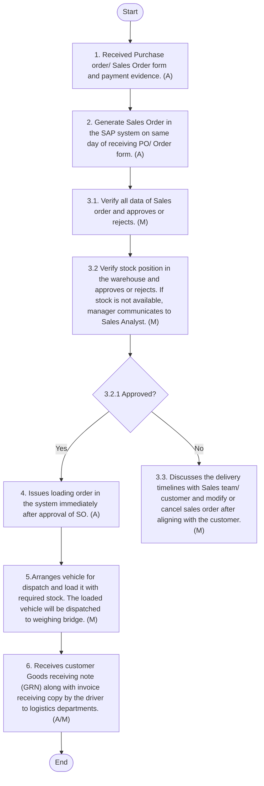

## Sales Order Process

#### Policy Statements
The sales order process is a critical control point for recognizing revenue at Arabian Mills. The following policies shall apply:
 Sales orders shall be supported by appropriate documentation, such as:
o	A valid customer Purchase Order (PO),
o	A Company-approved Standard Order Form duly signed and stamped by the customer, or
o	A Standard Order Form signed by an authorized Sales team member on behalf of the customer.
These documents shall serve as verifiable evidence for initiating the order and must be retained for audit purposes.
 All Sales Orders shall be entered into the SAP system, regardless of current stock or logistics status. This should ensure data integrity and alignment with inventory and financial records.
 Only designated Sales Admins or Sales Analysts shall be authorized to create or process sales orders within the SAP system. This should ensure system integrity and role-based access control.
 A dedicated team of Sales Coordinators at both Head Office and regional branches shall report to the Sales Analyst and shall be responsible for collecting, verifying, and submitting required sales documents on a timely basis.
 To maintain segregation of duties and internal control:
o The Sales Analyst shall verify documentation and entering sales orders.
o The Supply Chain team shall manage stock availability, verification, and timely dispatches.
o The Finance Department shall verify cash, credit limits, ensuring invoicing accuracy, and recording revenue in the financial system.
 The stock shall be dispatched within 48 hours, or at max up to 72 hours, of recording sales order.
In B2B sales, each sales order form should accompany a written declaration by the distributors stating that the expected quantities shall be delivered to the respective bakeries/customers as per the approved quota.
#### B2C Sales Procedure
The following procedures shall be followed during B2C Sales Process:

| S No. | Procedure description | Responsibility | Frequency |
| --- | --- | --- | --- |
| 1 | **Purchase Order (PO) / Sales Order Form Received from the Customer:**<br>• The Sales Analyst/Admin receive s p urchase order / s ales o rder form and cash deposit evidence (where applicable) via email from the customer or from Sales team through other medium . | **Preparer: Customer/Sales Team**<br>• Reviewer: Sales Analyst | Frequency: As required |
| 2 | **Generating Sale Order (SO):**<br>• The Sales analyst/Admin generate s s ales o rder in the SAP system on same day of receiving PO / Order form .<br>• Note:<br>• s ales o rder can be generated in SAP system even when tock is not available, or c redit limit is exhausted. | **Preparer:**<br>• Sales Analyst .<br>• Reviewer: Relevant Sales Manager | Frequency: As required |
| 3 | **SAP Credit and Control Check**<br>• SAP performs an automated control to check credit limit of customer ’s and stock availability. In case of credit limit or required stock is not available then sales order is not approved in SAP for further processing until both conditions are satisfied. | Performed by: SAP automated control | Frequency: As required |
| 4 | **Supply chain issue Loading Order to Logistics**<br>• The Supply chain issues loading order in the system immediately after approval of SO.<br>• Refer logistics manual for details. | **Preparer: Refer logistics manual**<br>• Reviewer: Sales Analyst and Relevant Sales Manager | Frequency: As required |
| 5 | **Logistics arrange vehicle for dispatch**<br>• The Logistics manager arranges vehicle for dispatch and load s it with required stock. The loaded vehicle is dispatched to the weighing bridge. This process is completed within 24 hours of SO approval from the Finance and Supply chain.<br>• Refer logistics manual for details. | **Preparer: Logistics Manager**<br>• Reviewer: Sales Analyst and Relevant Sales Manager | Frequency: As required |
| 6 | **Stock Delivery and Invoicing**<br>• The weighing bridge weighs the vehicle, and the system generates the invoice. The company hands over the original and a copy of the Invoice, Purchase Order, and Loading Order to the vehicle driver for the customer’s receipt. After receiving the stock, the driver submits the customer’s Goods Receiving Note (GRN) along with the invoice receipt copy to the logistics department. If the customer does not issue a GRN, the company accepts receiving based on the Invoice and Loading Order.<br>• Note:<br>• Finance ensures invoice accuracy and issues invoices or resolves any system issues at the time the vehicle exits the weighing bridge. All receiving documents are submitted to Finance for record-keeping. The AR Accountant, together with the relevant Sales team, manages credit recovery. The Sales Analyst supports coordination and communication. | **Prepare : Logistics Manager**<br>• Approver: Accounting Manager<br>• Reviewer: Sales Analyst and Relevant Sales Manager | Frequency: As required |

#### Flow Chart

**[Diagram — Visio-EMF→PNG]:**

**Process Name:** B2C Sales Process  

**Roles / Swimlanes:**
- Sales
- Accounting Manager
- Supply Chain
- Logistics Manager

---

### Steps

| Step # | Role              | Action | Decision/Next Step |
|--------|-------------------|--------|--------------------|
| Start  | Sales             | Start | Proceeds to Step 1. |
| 1      | Sales             | 1. Received Purchase order/ Sales Order form and cash deposit evidence. (A) | Proceeds to Step 2. |
| 2      | Sales             | 2. Generate Sales Order in the SAP system on same day of receiving PO/Order form. (A) | Proceeds to Step 3.1. |
| 3.1    | Accounting Manager | 3.1. Verify all data of Sales order and approves or rejects. (M) | Proceeds to Step 3.2. |
| 3.2    | Supply Chain      | 3.2 Verify stock position in the warehouse according to Sales order and approves or rejects. If stock is not available, manager communicates to Sales Analyst. (M) | Proceeds to Decision 3.2.1. |
| 3.2.1  | Supply Chain      | 3.2.1 Approved? | **Yes:** Proceeds to Step 4.  **No:** Proceeds to Step 3.3. |
| 3.3    | Sales             | 3.3. Discusses the delivery timelines with Sales team/ customer and modify or cancel sales order after aligning with the customer.(M) | Reached via “No” branch from 3.2.1; no subsequent step shown. |
| 4      | Sales             | 4. Issues loading order in the system immediately after approval of SO. (A) | Proceeds to Step 5. |
| 5      | Logistics Manager | 5. Arranges vehicle for dispatch and load it with required stock. The loaded vehicle will be dispatched to weighing bridge. (M) | Proceeds to Step 6. |
| 6      | Logistics Manager | 6. Receives customer Goods receiving note (GRN) along with invoice receiving copy by the driver to logistics departments. (A/M) | Proceeds to End. |
| End    | Logistics Manager | End | Process terminates. |

---

### Mermaid.js Flow

```mermaid
graph TD

    S[Start]

    A1[1. Received Purchase order/ Sales Order form<br/>and cash deposit evidence. (A)]
    A2[2. Generate Sales Order in the SAP system<br/>on same day of receiving PO/Order form. (A)]

    B1[3.1. Verify all data of Sales order<br/>and approves or rejects. (M)]

    C1[3.2 Verify stock position in the warehouse<br/>according to Sales order and approves or rejects.<br/>If stock is not available, manager communicates<br/>to Sales Analyst. (M)]

    D{3.2.1 Approved?}

    A3[3.3. Discusses the delivery timelines with Sales team/<br/>customer and modify or cancel sales order after<br/>aligning with the customer.(M)]

    A4[4. Issues loading order in the system<br/>immediately after approval of SO. (A)]

    L1[5. Arranges vehicle for dispatch and load it<br/>with required stock. The loaded vehicle will be<br/>dispatched to weighing bridge. (M)]

    L2[6. Receives customer Goods receiving note (GRN)<br/>along with invoice receiving copy by the driver<br/>to logistics departments. (A/M)]

    E[End]

    S --> A1 --> A2 --> B1 --> C1 --> D
    D -- Yes --> A4 --> L1 --> L2 --> E
    D -- No --> A3
```

#### B2B Sales Procedure
The following procedures shall be followed during B2B Sales Process:

| S No. | Procedure description | Responsibility | Frequency |
| --- | --- | --- | --- |
| 1 | **Purchase Order (PO)/ Sales Order Form Received from the Customer:**<br>• The Sales Analyst/Admin receives the purchase or sales order form, including customer details and stock delivery quantities (for B2B distributors), along with payment proof via email from the customer or through other channels from the sales team. All sales are conducted on an advance cash basis. | **Preparer: Customer/Sales Team**<br>• Reviewer: Sales Analyst | Frequency: As required |
| 2 | **Generating Sale Order (SO):**<br>• The Sales A nalyst/Admin generate s Sales Order in the SAP system on same day of receiving PO/Order form .<br>• Note:<br>• S ales O rder can be generated in SAP system even when Stock is not available . | **Preparer:**<br>• Sales Analyst.<br>• Reviewer: Relevant Branch Sales Manager | Frequency: As required |
| 3 | **SAP Credit and Control Check**<br>• SAP perform s an automated control to check credit limit of customer and stock availability. In case of credit limit or required stock is not available then sales order is not approved in SAP for further processing until both conditions are satisfied. | Performed by: SAP automated control | Frequency: As required |
| 4 | **Supply chain issue Loading Order to Logistics**<br>• The Supply chain issues the loading order in the system immediately after approval of the sales order .<br>• Refer logistics manual for details. | **Preparer: Refer logistics manual**<br>• Reviewer: Sales Analyst and Relevant Branch Sales Manager | Frequency: As required |
| 5 | **Logistics arrange vehicle for dispatch**<br>• The Logistics manager arranges a vehicle for dispatch and load s it with the required stock. The loaded vehicle is dispatched to the weighing bridge. This process needs to be done within 24 hours of SO approval from the Finance and Supply chain.<br>• Refer logistics manual for details. | **Preparer: Logistics Manager**<br>• Reviewer: Sales Analyst and Relevant Branch Sales Manager | Frequency: As required |
| 6 | **Stock Delivery and Invoicing**<br>• The v ehicle is weighed at the weighing bridge , and the invoice is generated from the system The original and a copy of the Invoice, Purchase Order, and Loading Order are handed over to the vehicle driver for customer receipt.<br>• After receiving of stocks , the driver submits the customer ’s Goods receiving note (GRN) along with Invoice receiving copy to logistics department. In case customer does not issue GRN, a receiving on Invoice and Loading order is sufficient .<br>• Note:<br>• Finance is responsible for Invoice correctness, issuance or any issue arising in the system at the time of vehicle exit on weighing bridge. All receiving is submitted to Finance for record keeping purpose. AR accountant is responsible for credit recovery along with relevant Sale s team . However, Sales Analyst support s in coordination and communication. | **Prepare: Logistics Manager**<br>• Approver: Accounting Manager<br>• Reviewer: Sales Analyst and Relevant Branch Sales Manager | Frequency: As required |

#### Flow Chart

**[Diagram — Visio-EMF→PNG]:**

**Process Name:** B2B Sales Process  

**Roles / Swimlanes:**
- Sales
- Accounting Manager
- Supply Chain
- Logistics Manager

---

### Steps

| Step # | Role              | Action | Decision/Next Step |
|--------|-------------------|--------|--------------------|
| Start  | Sales             | Start | Proceeds to **1. Received Purchase order/ Sales Order form and payment evidence. (A)** |
| 1      | Sales             | 1. Received Purchase order/ Sales Order form and payment evidence. (A) | Proceeds to **2. Generate Sales Order in the SAP system on same day of receiving PO/ Order form. (A)** |
| 2      | Sales             | 2. Generate Sales Order in the SAP system on same day of receiving PO/ Order form. (A) | Proceeds to **3.1. Verify all data of Sales order and approves or rejects. (M)** |
| 3.1    | Accounting Manager| 3.1. Verify all data of Sales order and approves or rejects. (M) | Proceeds to **3.2 Verify stock position in the warehouse and approves or rejects. If stock is not available, manager communicates to Sales Analyst. (M)** |
| 3.2    | Supply Chain      | 3.2 Verify stock position in the warehouse and approves or rejects. If stock is not available, manager communicates to Sales Analyst. (M) | Proceeds to decision **3.2.1 Approved?** |
| 3.2.1  | Supply Chain      | 3.2.1 Approved? | **Yes** → Proceeds to **4. Issues loading order in the system immediately after approval of SO. (A)**; **No** → Proceeds to **3.3. Discusses the delivery timelines with Sales team/ customer and modify or cancel sales order after aligning with the customer.(M)** |
| 3.3    | Sales             | 3.3. Discusses the delivery timelines with Sales team/ customer and modify or cancel sales order after aligning with the customer.(M) | Outgoing next step is not explicitly shown in the diagram. |
| 4      | Sales             | 4. Issues loading order in the system immediately after approval of SO. (A) | Proceeds to **5.Arranges vehicle for dispatch and load it with required stock. The loaded vehicle will be dispatched to weighing bridge. (M)** |
| 5      | Logistics Manager | 5.Arranges vehicle for dispatch and load it with required stock. The loaded vehicle will be dispatched to weighing bridge. (M) | Proceeds to **6. Receives customer Goods receiving note (GRN) along with invoice receiving copy by the driver to logistics departments. (A/M)** |
| 6      | Logistics Manager | 6. Receives customer Goods receiving note (GRN) along with invoice receiving copy by the driver to logistics departments. (A/M) | Proceeds to **End** |
| End    | Logistics Manager | End | — |

---

### Decision Branches

- **Decision 3.2.1 Approved?**
  - **Yes** → 4. Issues loading order in the system immediately after approval of SO. (A)
  - **No** → 3.3. Discusses the delivery timelines with Sales team/ customer and modify or cancel sales order after aligning with the customer.(M)

---

