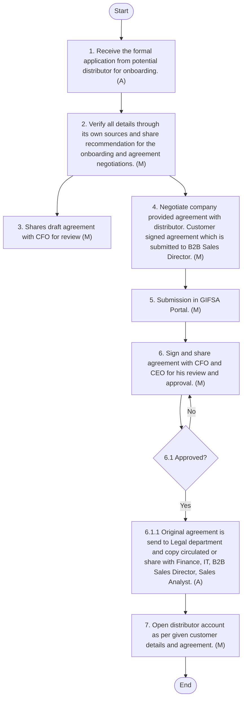

## New Customer Onboarding

#### Policy Statements
 All new B2C customers onboarding processes shall involve detailed customer profiling, category insights such as customer insights, category size and competitors’ offerings etc.
 A revenue and volume expectation along with annual joint Promotional Plan shall be developed to have realistic expectation from the specific customer.
 Business revenue and volume commitments by the customer shall form part of the agreement.
 Monthly review meetings shall be conducted to keep track on the progress and any hurdles facing for business growth.
 Only approved customer with verified legal status and relevant reach in the target market shall be onboarded.
 Evaluation shall be based on customer reputation, customer base, alignment with the Company's brand, and commercial terms.
 A sales expectation along with annual joint Promotional Plan shall be developed to have realistic expectation from the specific customer.
 The Head of Sales shall pre-approve all listed SKUs.
 Updates (e.g., pack change, price change) should be communicated within 3 working days.
 Sales and Trade Marketing shall ensure the timely completion of customer onboarding forms, product sheets, and legal agreements.
 The MRP and selling price on customer platforms should match the approved Pricing strategy.
 Sales and Warehouse teams shall coordinate on inventory allocation to avoid stockouts or over-commitments.
 Sales and Trade Marketing shall monitor pricing integrity across all customers and address undercutting or unauthorized listings.
 Queries, reviews, or complaints received via customer should be responded to within 24–48 hours.
 A summary report shall be submitted to senior management quarterly.
 Sales and Trade Marketing shall reserve the right to delist products or suspend customer partnerships due to breach of contract, pricing policy violations, or reputational risk.
 Any such action should be documented and approved by the Head of Sales and Legal Advisor.
#### Modern Trade or Key Accounts Procedure
The following procedures shall be followed for Modern Trade or Key Accounts Procedure:

| S No. | Procedure description | Responsibility | Frequency |
| --- | --- | --- | --- |
| 1 | **Customer Share it Proposal:**<br>• The Key Account Manager receive s the p roposal from customer for onboarding. The proposal must accompany or ask for at least following data:<br>• Comprehensive details about customer and its operations.<br>• Customer insights and more ( specifically category relevant ) .<br>• Category size and growth rate.<br>• Competitors’ products available and their offerings. | **Preparer: Customer**<br>• Reviewer: Director B2C Sales and Key Accounts Manager | Frequency: As required |
| 2 | **Survey Market:**<br>• Key Accounts Manager verifies all details through its own sources the performance of customer , competitors’ rebates, discounts, and targets and share s recommendation for the agreement negotiations and consensus building with B2C Sales Director , Head of Marketing and Trade Marketing Manager via email with in one week. | **Preparer:**<br>• Key Accounts Manager .<br>• Reviewer: Trade Marketing Manager & Head of M arketing<br>• Approver: B2C Sales Director | Frequency: As required |
| 3 | **Review By Finance**<br>• B2C Sales Director share s the customer proposal and recommended counter proposals with the CFO for review . Review is done within 2 days. | **Preparer:**<br>• B2C Sales Director.<br>• Reviewer: FP&A Manager<br>• Approver: CFO | Frequency: As required |
| 4 | **Negotiation with Customer**<br>• Upon consensus building and approval from Finance , Key Account Manager along with the Trade M arketing Manager negotiate s the proposal / propose s counter proposals with the customer as per the given approval from B2C Sales Director and CFO . The Customer submit s a draft agreement. The agreement must contain Sales expectations. This process is completed with in 3 weeks of the initial communication. | Preparer: Key Account Manager and Trade Marketing Manager . | Frequency: As required |
| 5 | **Review of Draft Agreement b y Sales & Marketing**<br>• Trade Marketing Manager email s draft agreement to Head of sales, Director B2C Sales and Head of Marketing for their review and approval. Review and approval ar e done within 3 Day s of receiving draft agreement . | **Preparer: Trade Marketing Manager**<br>• Reviewer: Head of Sales , Director B2C Sales & Head of Marketing | Frequency: As required |
| 6 | **Review of draft agreement by Legal and Fina n ce**<br>• After Sales and Marketing approval, Trade Marketing Manager email s the draft agreement to Head of legal and CFO for review and approval. After legal review and approval, The CFO review s and suggest s amendments’ or approve it. In case of amendments, re start from procedure number 4 .<br>• For credit sales, the CFO shares the credit limit and any further requirements such as a promissory note. | **Preparer: Trade Marketing Manager**<br>• Reviewer: CFO and Head of Legal | Frequency: As required |
| 7 | **Confirmation of Agreed Terms**<br>• Trade Marketing manager confirm s agreed terms and draft agreement to the customer via email and ask for official s igned agre ement for further process. | Preparer /Performed by : Trade Marketing Manager |  |
| 8 | **Official Agreement**<br>• After approval from legal and CFO, the customer submit s the official signed agreement along with required documentations such as CR , Owner ID, VAT documents etc . This document is officially signed by Head of Sales and witnessed by CFO and Legal. | **Prepare: Customer**<br>• Approver: Head of Sales , CFO and Legal | Frequency: As required |

#### Flow Chart

**[Diagram — PNG]:**

**Process Name:** B2C-Mordern Trade  

**Roles / Swimlanes:**

- Key Accounts Manager  
- B2C Sales Director  
- Trade Marketing Manager  
- Sales and Marketing  
- CFO  

---

### Steps

| Step # | Role                    | Action                                                                                                                                                                                                 | Decision/Next Step                                                                                                                                                                                      |
|--------|-------------------------|--------------------------------------------------------------------------------------------------------------------------------------------------------------------------------------------------------|---------------------------------------------------------------------------------------------------------------------------------------------------------------------------------------------------------|
| Start  | Key Accounts Manager    | Start                                                                                                                                                                                                  | Proceeds to **Step 1**.                                                                                                                                                                                |
| 1      | Key Accounts Manager    | 1. Receives the Proposal from customer for onboarding. (A)                                                                                                                                            | Proceeds to **Step 2**.                                                                                                                                                                                |
| 2      | Key Accounts Manager    | 2. Verify all details through its own sources and share recommendation for the agreement negotiations and consensus building. (M)                                                                     | Proceeds to **Step 3**.                                                                                                                                                                                |
| 3      | B2C Sales Director      | 3. Share customer proposal and recommended counter proposals with CFO for review. (M)                                                                                                                | Proceeds to **Step 4**.                                                                                                                                                                                |
| 4      | Key Accounts Manager    | 4. Along with Trade Marketing Manager negotiate proposal with customer as per given approval from B2C Sales Director and CFO. (M)                                                                    | Proceeds to **Step 5**.                                                                                                                                                                                |
| 5      | Trade Marketing Manager | 5. Email draft agreement to Head of sales, Director B2C Sales and Head of Marketing for their review and approval. (M)                                                                               | Proceeds to **Step 6**.                                                                                                                                                                                |
| 6      | Sales and Marketing     | 6. Approved?                                                                                                                                                                                           | **Yes:** Proceeds to **Step 7**.  **No:** Return to **Step 4** (Along with Trade Marketing Manager negotiate proposal with customer as per given approval from B2C Sales Director and CFO. (M)).       |
| 7      | Trade Marketing Manager | 7. Email draft agreement to Head of legal and CFO. CFO will review and suggest amendments’ or approve it. (M)                                                                                        | Proceeds to **Step 8**.                                                                                                                                                                                |
| 8      | CFO                     | 8. Approved?                                                                                                                                                                                           | **Yes:** Proceeds to **Step 9**.  **No:** Return to **Step 7** (Email draft agreement to Head of legal and CFO. CFO will review and suggest amendments’ or approve it. (M)).                           |
| 9      | Sales and Marketing     | 9. Confirm agreed terms and draft agreement to the customer via email and ask for official signed agreement for further process. (A)                                                                 | Proceeds to **Step 10**.                                                                                                                                                                               |
| 10     | Sales and Marketing     | 10. Customer submit official signed agreement along with required documentations. This document officially signed by Head of Sales. (A)                                                             | Proceeds to **End**.                                                                                                                                                                                   |
| End    | Sales and Marketing     | End                                                                                                                                                                                                    | —                                                                                                                                                                                                       |

---

### Mermaid.js Flow

```mermaid
graph TD

    Start((Start))
    S1[1. Receives the Proposal from customer for onboarding. (A)]
    S2[2. Verify all details through its own sources and share recommendation for the agreement negotiations and consensus building. (M)]
    S3[3. Share customer proposal and recommended counter proposals with CFO for review. (M)]
    S4[4. Along with Trade Marketing Manager negotiate proposal with customer as per given approval from B2C Sales Director and CFO. (M)]
    S5[5. Email draft agreement to Head of sales, Director B2C Sales and Head of Marketing for their review and approval. (M)]
    D6{6. Approved?}
    S7[7. Email draft agreement to Head of legal and CFO. CFO will review and suggest amendments’ or approve it. (M)]
    D8{8. Approved?}
    S9[9. Confirm agreed terms and draft agreement to the customer via email and ask for official signed agreement for further process. (A)]
    S10[10. Customer submit official signed agreement along with required documentations. This document officially signed by Head of Sales. (A)]
    End((End))

    Start --> S1 --> S2 --> S3 --> S4 --> S5 --> D6
    D6 -- "No" --> S4
    D6 -- "Yes" --> S7
    S7 --> D8
    D8 -- "No" --> S7
    D8 -- "Yes" --> S9 --> S10 --> End
```

#### Other Customer Procedure
The following procedures shall be followed for other B2C channel customers Procedure:

| S No. | Procedure description | Responsibility | Frequency |
| --- | --- | --- | --- |
| 1 | **Sales Team share Customer Details and Proposal:**<br>• The Relevant Sales Manager / Sales Specialist share s the Proposal to onboard customer. The proposal must accompany with at least following data:<br>• Comprehensive details about customer and its operations.<br>• Customer insights and more specifically category relevant.<br>• Category size and growth rate.<br>• Competitors’ products available and their offerings.<br>• Business expectation<br>• Discounts and Promotion recommendations. | **Preparer: Relevant Sales Manager/Specialist**<br>• Reviewer: Director B2C Sales | Frequency: As required |
| 2 | **Survey Market:**<br>• B2C Sales Director verif ies all details through its own sources the performance of customer, competitors’ rebates, discounts, and targets , discuss es it with Trade Marketing manager and share s recommendation for the agreement negotiations and consensus building with relevant Sales Manager/Sales Specialist and Trade Marketing Manager via email with in one week. | • .<br>• Reviewer: Trade Marketing Manager<br>• Approver: B2C Sales Director | Frequency: As required |
| 3 | **Review By Finance**<br>• B2C Sales Director share s sales proposal and recommended consensus build counter proposals with CFO for review within 2 days . | **Preparer:**<br>• B2C Sales Director.<br>• Reviewer: FP&A Manager<br>• Approver: CFO | Frequency: As required |
| 4 | **Negotiation with Customer**<br>• Upon consensus building and approval from Finance , Sales Manager/Sales Specialist negotiate s proposal with customer as per given approval from B2C Sales Director.<br>• Upon verbal agreement, the Sales Manager or Sales Specialist fills the standard agreement form with the required data and submits the draft agreement to the Sales Analyst. The agreement contains sales expectations. The team completes this process within two weeks of the initial communication. | • Preparer: Sales Manager/Sales Specialist.<br>• Reviewer:<br>• Customer, B2C Sales Director , and Sales Analyst | Frequency: As required |
| 5 | **Review of Draft Agreement by Sales & Marketing**<br>• Sales Analyst email s draft agreement to Head of sales, and Head of Marketing for review and approval within 2 Day s of receiving draft agreement . | **Preparer: Sales Analyst**<br>• Reviewer: Head of Sales, & Head of Marketing | Frequency: As required |
| 6 | **Review of draft agreement by Legal and Finance**<br>• After Sales and Marketing approval, Sales Analyst email s draft agreement to Head of legal and CFO for review and approval. After legal review and approval, CFO review s and suggest amendments’ or approve it. In case of amendments, re start from procedure number 4 .<br>• In case of credit sales, CFO share s credit limit and any further requirement such as promissory note. | **Preparer: Sales Analyst**<br>• Reviewer: CFO and Head of Legal | Frequency: As required |
| 7 | **Official Agreement**<br>• After approval from L egal and CFO, Sales Analyst prepare s the official agreement and send s it to relevant Sales team for customer approval. Sales team l collect s and submit s signed agreement along with required documentations such as CR, Owner ID, VAT documents etc. This document is officially signed by Head of Sales and witnessed by CFO and Legal. | **Prepare: Sales Analyst**<br>• Approver: Head of Sales, CFO and Legal | Frequency: As required |

#### Policy Statement-B2B Customers
 All B2B customers and distributors shall onboard through formal procedure to ensure transparency. Branch Sales Manager/ Branch Manager along Sales Specialist should visit and verify all customer/bakeries details for processing customer application for quota approval inGIFSA portal.
 B2B Sales Director and Finance shall be part of the internal approval process.
 A formal application procedure shall follow for onboarding B2B distributors with required business documents and quota approval/allocation from the GIFSA
 The Distributors should submit customer existing approved quota, if any, as a supporting document for onboarding.
#### Distributor Onboarding Procedure
The following procedures shall be followed for distributor onboarding:

| S No. | Procedure description | Responsibility | Frequency |
| --- | --- | --- | --- |
| 1 | **Distributor Application:**<br>• The Branch Sales Manager receive s the formal application from potential distributor for onboarding. A standard form is developed to collect important data. The application inc ludes following data and documents :<br>• Complete Distributor profile<br>• Years in Business<br>• Current client s .<br>• Geographic coverage<br>• A brief business plan s .<br>• AM C ompetitors details and their volume, if applicable. | **Preparer: Customer**<br>• Reviewer: Branch Sales Manager | Frequency: As required |
| 2 | **Information gathering :**<br>• Branch Sales Manager visit s and verif ies distributor performance and customer details, shares recommendations with B2B Sales Director via email within 3 days If rejected, informs Sales Specialist and B2B Sales Director with reasons. Sales Specialist informs distributor accordingly. | **Preparer:**<br>• Branch Sales Manager<br>• Reviewer: B2B Sales Director<br>• Approver: Head of Sales | Frequency: As required |
| 3 | **Review By Finance**<br>• B2B Sales Director share s the draft agreement with CFO for review. Review is done within 2 days. | **Preparer:**<br>• B2 B Sales Director.<br>• Reviewer: FP&A Manager<br>• Approver: CFO | Frequency: As required |
| 4 | **Negotiation with B2B Distributor**<br>• After approval from Head of Sales, Branch Sales Manager along with Sales Specialist negotiate C ompany provided agreement with value and volume commitment, margins (like B2C standard sale agreements) with distributor as per given approval from B2B Sales Director within 8 days of application submission. Customer sign ed agreement is submitted to B2B Sales Director. | **Preparer: Branch Sales Manager**<br>• Approver:<br>• Distributor | Frequency: As required |
| 5 | **Submission in GIFSA Portal**<br>• Sales Analyst upload s all customer details and documents in GIFSA portal for approval or rejection . | **Preparer: Sales Analyst**<br>• Reviewer: Accounting Manager and Director B2B Sales | Frequency: As required |
| 6 | **Submission to Finance and CEO**<br>• B2B Sales Director sign s and share s agreement with CFO for his review and approval. After CFO sign ature and approval, it is submitted for CEO approval . The process is comple ted within 2 d ay s of receiving signed agreement from the customer .<br>• After getting CEO approval, the original agreement sent to Legal department and cop y is circulated or shared with Finance, IT, B2B Sales Director, Sales Analyst, Branch Manager, and Branch Sales Manager for record keeping . | **Preparer: B2B Sales Director**<br>• Approver: CEO and CFO | Frequency: As required |
| 7 | **Opening of Distributor Account**<br>• IT and Cyber Manager open s distributor account as per given customer details and agreement. This must be completed within 1 day of formal approval from CEO. The Branch Sales Manager and Sales analyst verify all data after opening account in the system by IT and Cyber Manager. | **Preparer: IT and Cyber Manager**<br>• Reviewer:<br>• Branch Sales Manager and Sales Analyst<br>• Approver: Accounting Manager | Frequency: As required |

#### Flow Chart

**[Diagram — Visio-EMF→PNG]:**

**Process Name:** B2B-Distributor  

**Roles / Swimlanes:**
- Branch Sales Manager
- Sales Analyst
- B2B Sales Director
- CEO
- IT Manager  

---

### Steps and Flow

| Step # | Role | Action | Decision/Next Step |
|--------|------|--------|--------------------|
| Start | Branch Sales Manager | Start | Proceeds to step **1. Receive the formal application from potential distributor for onboarding. (A)** |
| 1 | Branch Sales Manager | 1. Receive the formal application from potential distributor for onboarding. (A) | Proceeds to step **2. Verify all details through its own sources and share recommendation for the onboarding and agreement negotiations. (M)** |
| 2 | Branch Sales Manager | 2. Verify all details through its own sources and share recommendation for the onboarding and agreement negotiations. (M) | Main flow proceeds to **4. Negotiate company provided agreement with distributor. Customer signed agreement which is submitted to B2B Sales Director. (M)**. A separate flow proceeds downwards to **3. Shares draft agreement with CFO for review (M)**. |
| 3 | B2B Sales Director | 3. Shares draft agreement with CFO for review (M) | No explicit outgoing connector shown in the diagram; implied continuation within the overall process. |
| 4 | Branch Sales Manager | 4. Negotiate company provided agreement with distributor. Customer signed agreement which is submitted to B2B Sales Director. (M) | Proceeds to **5. Submission in GIFSA Portal. (M)** |
| 5 | Sales Analyst | 5. Submission in GIFSA Portal. (M) | Proceeds to **6. Sign and share agreement with CFO and CEO for his review and approval. (M)** |
| 6 | B2B Sales Director | 6. Sign and share agreement with CFO and CEO for his review and approval. (M) | Proceeds to decision **6.1 Approved?** |
| 6.1 Approved? | (Decision point between B2B Sales Director and CEO lanes) | 6.1 Approved? | **Yes** → proceeds to **6.1.1 Original agreement is send to Legal department and copy circulated or share with Finance, IT, B2B Sales Director, Sales Analyst. (A)**. **No** → returns to **6. Sign and share agreement with CFO and CEO for his review and approval. (M)** for rework/resubmission. |
| 6.1.1 | CEO | 6.1.1 Original agreement is send to Legal department and copy circulated or share with Finance, IT, B2B Sales Director, Sales Analyst. (A) | Proceeds to **7. Open distributor account as per given customer details and agreement. (M)** |
| 7 | IT Manager | 7. Open distributor account as per given customer details and agreement. (M) | Proceeds to **End** |
| End | IT Manager | End | — |

---

### Mermaid Flow Diagram



#### B2B Customer onboarding Procedure
The following procedures shall be followed for B2B Customer onboarding:

| S No. | Procedure description | Responsibility | Frequency |
| --- | --- | --- | --- |
| 1 | **Distributor Application:**<br>• The Branch Sales Manager receive s the customer documents such as CR, License , existing quota (if any) and other business documents from distributor for quota approval and onboarding . | **Preparer: B2B Distributor**<br>• Reviewer: Branch Sales Manager | Frequency: As required |
| 2 | **Information gathering:**<br>• Branch Sales Manager , Branch Manager and Sales Specialist visit and verify all details of customer and fill standard form with all required details of the customer and share it with B2B Sales Director, via email within 5 days of application. In case of rejection, Branch Sales Manager inform s Sales Specialist and B2B sales director reason of rejection. The Sales Specialist inform s distributor accordingly. | **Preparer:**<br>• Branch Manager, Branch Sales Manager and Sales Specialist<br>• Reviewer: B2B Sales Director<br>• Approver: Head of Sales and CFO | Frequency: As required |
| 4 | **Submission in GIFSA Portal**<br>• Sales Analyst upload s all customer details and documents in GIFSA portal for approval or rejection . | **Preparer: Sales Analyst**<br>• Reviewer : Accounting Manager and Director B2B Sales | Frequency: As required |
| 5 | **Opening of Customer in Distributor Account**<br>• After GIFSA approval, Sales Analyst requests IT and Cyber manager to add customer in distributor account with approved monthly quota . This process is completed within 1 days of formal approval from GIFSA. | **Preparer: Sales Analyst and IT and Cyber Manager**<br>• Reviewer:<br>• B2B Sales Director and Branch Sales Manager<br>• Approver: Accounting Manager | Frequency: As required |


**[Diagram — Visio-EMF→PNG]:**

**Process Name:** B2B Customer onboarding  

**Roles / Swimlanes:**
- Branch Sales Manager  
- Sales Analyst  

| Step # | Role                | Action | Decision/Next Step |
|--------|---------------------|--------|--------------------|
| Start  | Branch Sales Manager | Start | Next: Step 1 |
| 1      | Branch Sales Manager | Receives the customer documents such as CR, license, existing quota and other business documents from distributor (A) | Next: Step 2 |
| 2      | Branch Sales Manager | Visit and verify all details of customer and fill standard form with all required details of the customer and share it with B2B Sales Director (M) | Next: Step 3 |
| 3      | Sales Analyst        | Upload all customer details and documents in GIFSA portal. GIFSA will either approve it or reject in. (A/M) | Next: Step 4 (after GIFSA approval; rejection path not detailed in diagram) |
| 4      | Sales Analyst        | After GIFSA approval, Sales Analyst will ask IT manager to add customer in distributor account with approved monthly quota. (M) | Next: End |
| End    | Sales Analyst        | End | — |

```mermaid
graph TD

    Start((Start))
    S1[1. Receives the customer documents such as CR, license, existing quota and other business documents from distributor (A)]
    S2[2. Visit and verify all details of customer and fill standard form with all required details of the customer and share it with B2B Sales Director (M)]
    S3[3. Upload all customer details and documents in GIFSA portal. GIFSA will either approve it or reject in. (A/M)]
    S4[4. After GIFSA approval, Sales Analyst will ask IT manager to add customer in distributor account with approved monthly quota. (M)]
    End((End))

    Start --> S1 --> S2 --> S3 --> S4 --> End
```