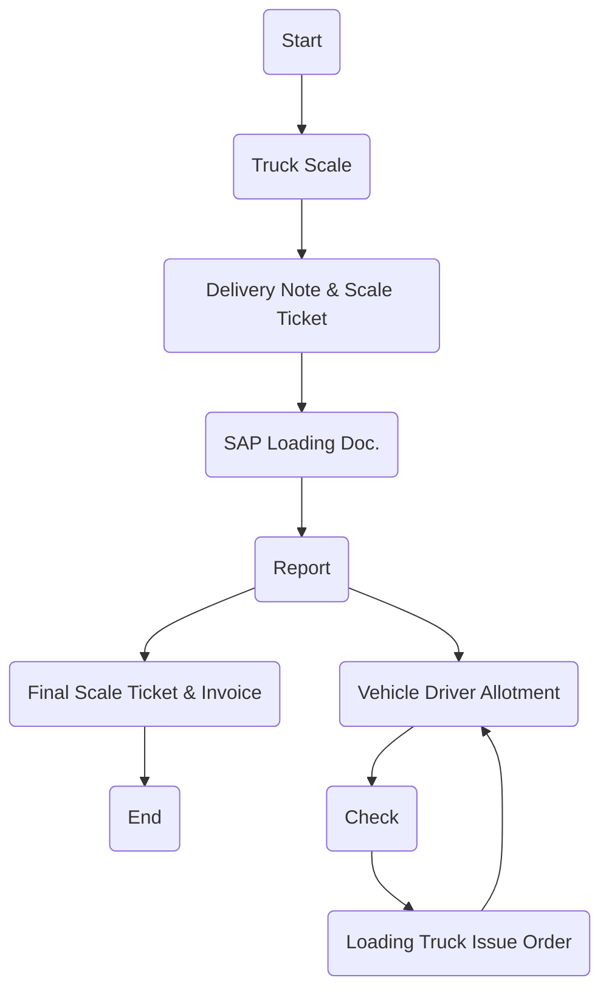

### Analysis of the Flowchart

1. **Process Name**: Finished Goods Transportation - Flour

2. **Roles (Swimlanes)**:
   - Sales
   - Weighin Scale
   - Transportation
   - Truck Driver
   - FG Warehouse

3. **Markdown Table of Steps**

| Step # | Role          | Action                         | Next Step/Logic             |
|--------|---------------|--------------------------------|-----------------------------|
| 1      | Sales         | Start                          | Truck Scale                 |
| 2      | Weighin Scale | Truck Scale                    | Delivery Note & Scale Ticket|
| 3      | Weighin Scale | Delivery Note & Scale Ticket   | SAP Loading Doc.            |
| 4      | Weighin Scale | SAP Loading Doc.               | Report                      |
| 5      | Transport     | Vehicle Driver Allotment       | Check                       |
| 6      | Truck Driver  | Check                          | Loading Truck Issue Order   |
| 7      | FG Warehouse  | Loading Truck Issue Order      | Vehicle Driver Allotment    |
| 8      | Weighin Scale | Report                         | Final Scale Ticket & Invoice|
| 9      | Sales         | Final Scale Ticket & Invoice   | End                         |

4. **Mermaid.js Code Block**

This code block represents the flow and decisions within the process using Mermaid.js syntax, showing explicit paths and the loop for "Vehicle Driver Allotment."