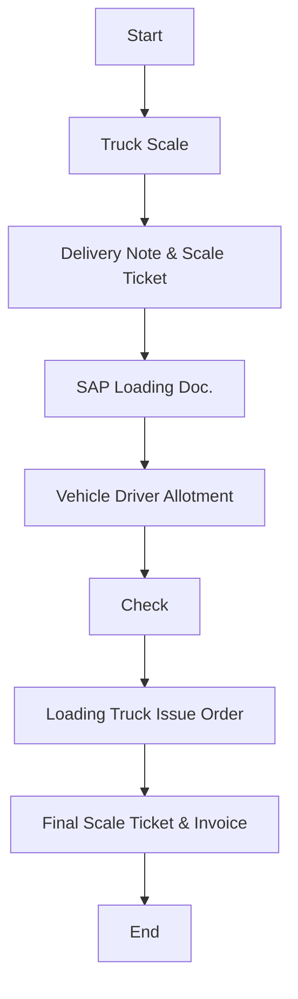

Certainly! Below is the analysis of the flowchart image.

### 1. Process Name
- Finished Goods Transportation - Animal Bran

### 2. Roles (Swimlanes)
- Sales
- Weighin Scale
- Transportation
- Truck Driver
- FG Warehouse

### 3. Steps in Markdown Table

| Step # | Role           | Action                        | Next Step/Logic            |
|--------|----------------|-------------------------------|----------------------------|
| 1      | Sales          | Start                         | Truck Scale                |
| 2      | Weighin Scale  | Truck Scale                   | Delivery Note & Scale Ticket|
| 3      | Weighin Scale  | Delivery Note & Scale Ticket  | SAP Loading Doc.           |
| 4      | Weighin Scale  | SAP Loading Doc.              | Vehicle Driver Allotment   |
| 5      | Transportation | Vehicle Driver Allotment      | Check                      |
| 6      | Truck Driver   | Check                         | Loading Truck Issue Order  |
| 7      | FG Warehouse   | Loading Truck Issue Order     | Final Scale Ticket & Invoice|
| 8      | Sales          | Final Scale Ticket & Invoice  | End                        |

### 4. Mermaid.js Code Block

This representation traces the logical flow from the start to the end of the "Finished Goods Transportation - Animal Bran" process, capturing each role's responsibility and decision path.