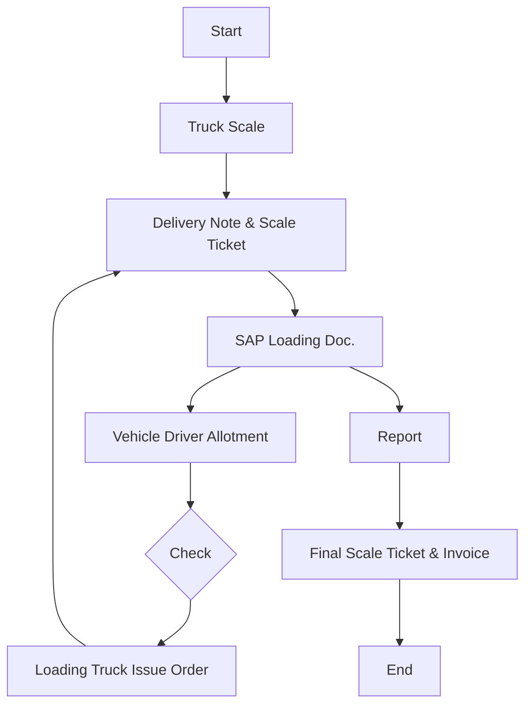

### Analysis of the Flowchart

#### 1. Process Name
- Finished Goods Transportation - Animal Feed

#### 2. Roles (Swimlanes)
- Sales
- Weigh-in Scale
- Transportation
- Truck Driver
- FG Warehouse

#### 3. Steps in Markdown Table

| Step # | Role               | Action                        | Next Step/Logic            |
|--------|--------------------|-------------------------------|----------------------------|
| 1      | Sales              | Start                         | Truck Scale                |
| 2      | Weigh-in Scale     | Truck Scale                   | Delivery Note & Scale Ticket|
| 3      | Weigh-in Scale     | Delivery Note & Scale Ticket  | SAP Loading Doc.           |
| 4      | Weigh-in Scale     | SAP Loading Doc.              | Vehicle Driver Allotment   |
| 5      | Transportation     | Vehicle Driver Allotment      | Check                      |
| 6      | Truck Driver       | Check                         | Loading Truck Issue Order  |
| 7      | FG Warehouse       | Loading Truck Issue Order     | Delivery Note & Scale Ticket |
| 8      | Weigh-in Scale     | Report                        | Final Scale Ticket & Invoice |
| 9      | Sales              | Final Scale Ticket & Invoice  | End                        |

#### 4. Mermaid.js Code Block

This structure represents the flow and decision paths of the Finished Goods Transportation process for Animal Feed as depicted in the flowchart.