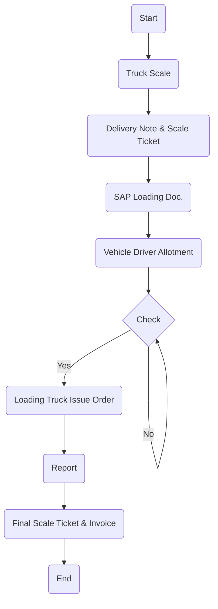

1. **Process Name**: Finished Goods Transportation - Packing Material & Spare Parts

2. **Roles (Swimlanes)**:
   - Sales
   - Weigh-in Scale
   - Transportation
   - Truck Driver
   - FG Warehouse

3. **Markdown Table**:

| Step # | Role             | Action                          | Next Step/Logic          |
|--------|------------------|---------------------------------|--------------------------|
| 1      | Sales            | Start                           | Step 2                   |
| 2      | Sales            | Truck Scale                     | Step 3                   |
| 3      | Weigh-in Scale   | Delivery Note & Scale Ticket    | Step 4                   |
| 4      | Weigh-in Scale   | SAP Loading Doc.                | Step 5                   |
| 5      | Transportation   | Vehicle Driver Allotment        | Step 6                   |
| 6      | Truck Driver     | Check                           | Yes: Step 7 / No: Step 6 |
| 7      | FG Warehouse     | Loading Truck Issue Order       | Step 8                   |
| 8      | Weigh-in Scale   | Report                          | Step 9                   |
| 9      | Sales            | Final Scale Ticket & Invoice    | End                      |

4. **Mermaid.js Code Block**:

