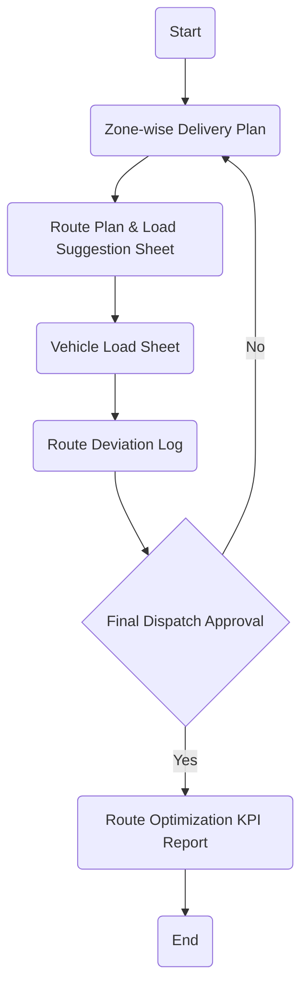

### Analysis

1. **Process Name**: Route and Load Optimization

2. **Roles** (Swimlanes):
   - Transportation
   - SAP Logistics User
   - Dispatch Supervisor
   - Driver / Gate Clerk

3. **Steps in a Markdown Table:**

| Step # | Role                 | Action                             | Next Step/Logic                 |
|--------|----------------------|------------------------------------|---------------------------------|
| 1      | Transportation       | Start                              | 2                               |
| 2      | Transportation       | Zone-wise Delivery Plan            | 3                               |
| 3      | SAP Logistics User   | Route Plan & Load Suggestion Sheet | 4                               |
| 4      | Dispatch Supervisor  | Vehicle Load Sheet                 | 5                               |
| 5      | Driver / Gate Clerk  | Route Deviation Log                | 6                               |
| 6      | Transportation       | Final Dispatch Approval            | Yes: 7, No: 2                   |
| 7      | Transportation       | Route Optimization KPI Report      | 8                               |
| 8      | Transportation       | End                                | —                               |

4. **Mermaid.js Code Block:**

This flowchart outlines the process for optimizing routing and load management, involving several roles and specific steps to reach the final report generation.