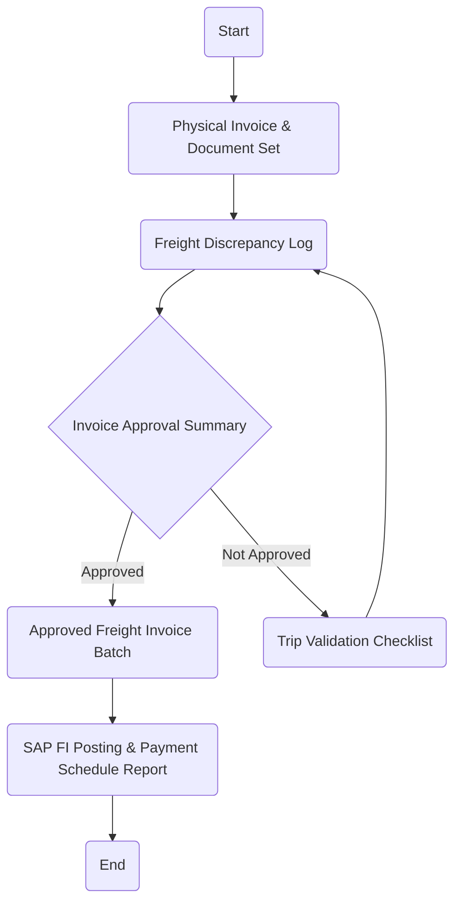

Sure, here is the analysis of the flowchart:

### 1. Process Name
Freight Invoice Process

### 2. Roles (Swimlanes)
- Transportation
- Dispatch Supervisor
- Logistics Manager
- Finance Coordinator

### 3. Steps in Markdown Table

| Step # | Role              | Action                                     | Next Step/Logic                   |
|--------|-------------------|--------------------------------------------|-----------------------------------|
| 1      | Transportation    | Start                                      | Physical Invoice & Document Set   |
| 2      | Transportation    | Physical Invoice & Document Set            | Freight Discrepancy Log           |
| 3      | Transportation    | Freight Discrepancy Log                    | Invoice Approval Summary          |
| 4      | Transportation    | Invoice Approval Summary                   | Approved -> Approved Freight Invoice Batch \n Not Approved -> Trip Validation Checklist |
| 5      | Dispatch Supervisor | Trip Validation Checklist                | Freight Discrepancy Log           |
| 6      | Logistics Manager | Approved Freight Invoice Batch             | SAP FI Posting & Payment Schedule Report |
| 7      | Finance Coordinator | SAP FI Posting & Payment Schedule Report | End                               |

### 4. Logic in Mermaid.js Code Block

This represents the flow of the Freight Invoice Process with explicit decision paths based on the invoice approval status.