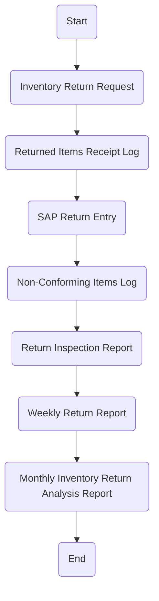

1. **Process Name**: Inventory Returns (internal)

2. **Roles** (Swimlanes):
   - Department User
   - DC Officer
   - Quality Inspector
   - Warehouse Section Head
   - Inventory Controller

3. **Markdown Table**:

| Step # | Role                   | Action                                  | Next Step/Logic                       |
|--------|------------------------|-----------------------------------------|---------------------------------------|
| 1      | Department User        | Start                                   | Inventory Return Request              |
| 2      | Department User        | Inventory Return Request                | Returned Items Receipt Log            |
| 3      | DC Officer             | Returned Items Receipt Log              | SAP Return Entry                      |
| 4      | DC Officer             | SAP Return Entry                        | Non-Conforming Items Log              |
| 5      | DC Officer             | Non-Conforming Items Log                | Return Inspection Report              |
| 6      | Quality Inspector      | Return Inspection Report                | Weekly Return Report                  |
| 7      | Warehouse Section Head | Weekly Return Report                    | Monthly Inventory Return Analysis Report |
| 8      | Inventory Controller   | Monthly Inventory Return Analysis Report| End                                   |

4. **Mermaid.js Code Block**:

