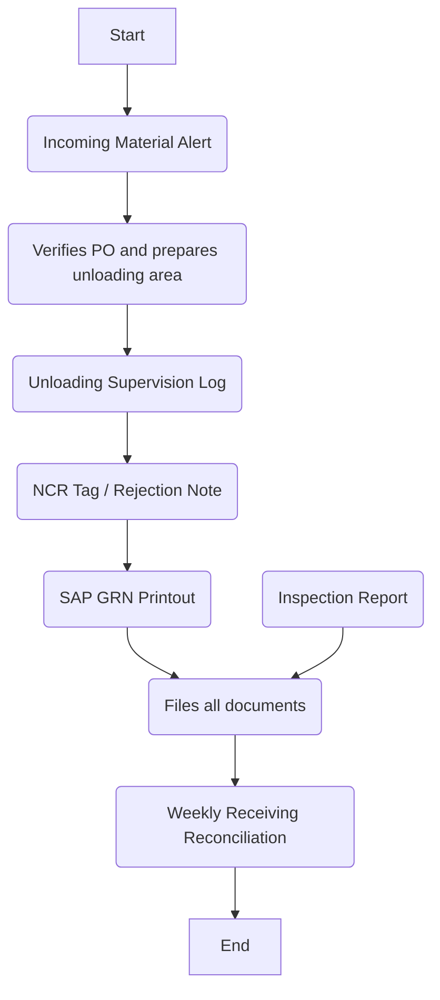

### Analysis of the Flowchart

#### 1. Process Name
- Inventory Returns (inbound)

#### 2. Roles (Swimlanes)
- Warehouse Section Head
- DC Officer
- Quality Inspector
- Inventory Controller

#### 3. Steps Extracted into a Markdown Table

| Step # | Role                  | Action                                                         | Next Step/Logic                       |
|--------|-----------------------|----------------------------------------------------------------|---------------------------------------|
| 1      | Warehouse Section Head| Start                                                          | Incoming Material Alert               |
| 2      | Warehouse Section Head| Incoming Material Alert                                        | Verifies PO and prepares unloading area |
| 3      | DC Officer            | Verifies PO and prepares unloading area for incoming vehicle   | Unloading Supervision Log             |
| 4      | DC Officer            | Unloading Supervision Log                                      | NCR Tag / Rejection Note              |
| 5      | DC Officer            | NCR Tag / Rejection Note                                       | SAP GRN Printout                      |
| 6      | Quality Inspector     | Inspection Report                                              | Files documents                       |
| 7      | DC Officer            | SAP GRN Printout                                               | Files documents                       |
| 8      | Inventory Controller  | Weekly Receiving Reconciliation                                | End                                   |

#### 4. Logic in Mermaid.js Code Block

