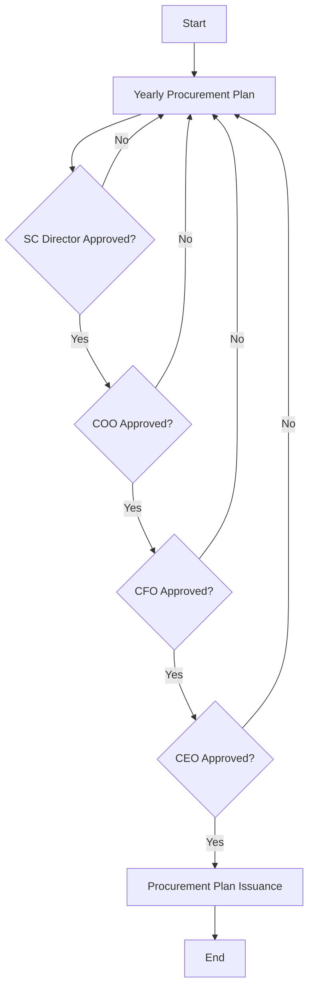

Certainly! Let's analyze the flowchart.

### 1. Process Name
- **Procurement Planning Flowchart**

### 2. Roles (Swimlanes)
- Procurement Manager
- SC Director
- COO
- CFO
- CEO

### 3. Steps as a Markdown Table

| Step # | Role              | Action                        | Next Step/Logic                                      |
|--------|-------------------|-------------------------------|------------------------------------------------------|
| 1      | Procurement Manager | Start                         | 2                                                    |
| 2      | Procurement Manager | Yearly Procurement Plan       | 3                                                    |
| 3      | SC Director       | Approved?                     | Yes: 4, No: 2 (Revision)                             |
| 4      | COO               | Approved?                     | Yes: 5, No: 2 (Revision)                             |
| 5      | CFO               | Approved?                     | Yes: 6, No: 2 (Revision)                             |
| 6      | CEO               | Approved?                     | Yes: 7, No: 2 (Revision)                             |
| 7      | Procurement Manager | Procurement Plan Issuance     | 8                                                    |
| 8      | Procurement Manager | End                           |                                                      |

### 4. Logic as Mermaid.js Code Block

This structure represents the steps and decision paths in the procurement planning flowchart.