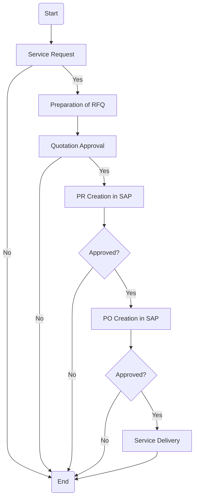

### Analysis of the Flowchart

#### 1. Process Name
- Corporate Service Procurement

#### 2. Roles (Swimlanes)
- Service Provider
- Requester
- Local Buyer/Procurement Officer
- SC Director
- CFO/COO
- CEO

#### 3. Steps Extracted in Markdown Table

| Step # | Role                           | Action                  | Next Step/Logic                     |
|--------|--------------------------------|-------------------------|-------------------------------------|
| 1      | Requester                      | Start                   | Service Request                     |
| 2      | Local Buyer/Procurement Officer| Service Request         | Approved?                           |
| 3      | SC Director                    | Approved? (No)          | End                                 |
| 4      | SC Director                    | Approved? (Yes)         | Preparation of RFQ                  |
| 5      | Local Buyer/Procurement Officer| Preparation of RFQ      | Quotation Approval                  |
| 6      | SC Director                    | Quotation Approval      | Approved?                           |
| 7      | SC Director                    | Approved? (No)          | End                                 |
| 8      | SC Director                    | Approved? (Yes)         | PR Creation in SAP                  |
| 9      | Local Buyer/Procurement Officer| PR Creation in SAP      | Approved?                           |
| 10     | SC Director                    | Approved?               | Yes                                 |
| 11     | CFO/COO                        | Approved? (Yes)         | PO Creation in SAP                  |
| 12     | Local Buyer/Procurement Officer| PO Creation in SAP      | Approved?                           |
| 13     | CEO                            | Approved? (Yes)         | Service Delivery                    |
| 14     | Service Provider               | Service Delivery        | End                                 |

#### 4. Mermaid.js Code Block

This outline captures the flow of the process, detailing the roles and the sequence of actions as specified in the flowchart.