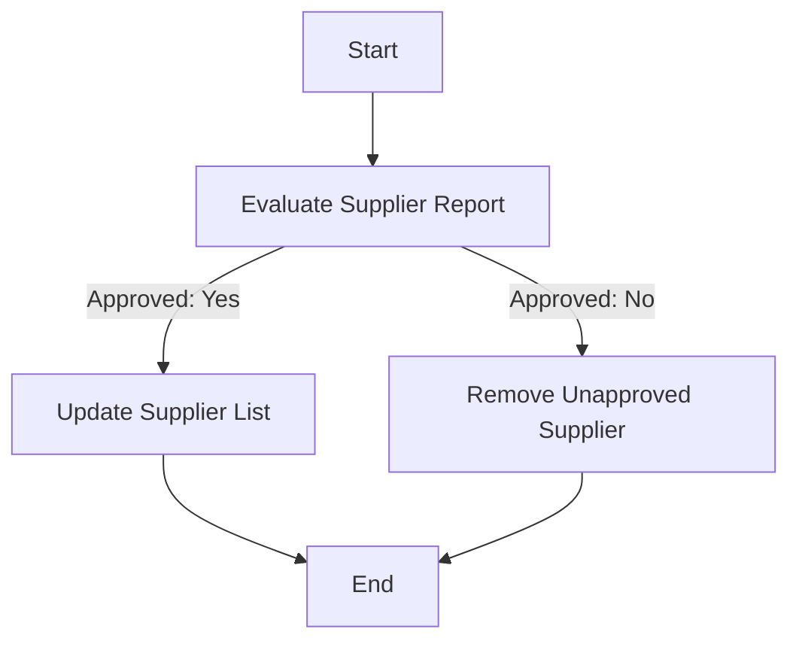

### Analysis of Flowchart

1. **Process Name**: Supplier Assessment

2. **Roles (Swimlanes)**:
   - Procurement Officer
   - Procurement Manager

3. **Steps in a Markdown Table**:

| Step # | Role               | Action                      | Next Step/Logic          |
|--------|--------------------|-----------------------------|--------------------------|
| 1      | Procurement Officer| Start                       | Step 2                   |
| 2      | Procurement Officer| Evaluate Supplier Report    | Approved? (Step 3)       |
| 3      | Procurement Manager| Approved: Yes               | Update Supplier List (Step 4) |
| 3      | Procurement Manager| Approved: No                | Remove Unapproved Supplier (Step 5) |
| 4      | Procurement Officer| Update Supplier List        | End                      |
| 5      | Procurement Manager| Remove Unapproved Supplier  | End                      |

4. **Mermaid.js Code Block**:

This structured analysis and Mermaid.js code provide a clear representation of how the process flows through different roles and decisions.