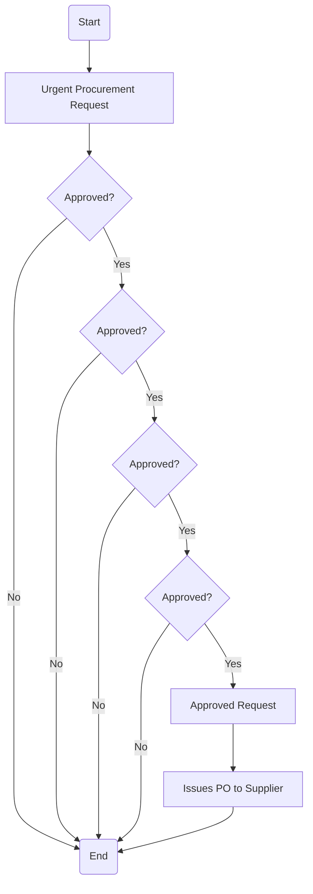

### Analysis of the Flowchart

1. **Process Name**: Urgent Procurement

2. **Roles (Swimlanes)**:
   - Initiator
   - Dept. Manager
   - Procurement Manager
   - SC Director / COO
   - FC / CFO / CEO

3. **Steps in a Markdown Table**:

   | Step # | Role               | Action                      | Next Step/Logic                         |
   |--------|--------------------|-----------------------------|-----------------------------------------|
   | 1      | Initiator          | Start                       | Step 2                                  |
   | 2      | Initiator          | Urgent Procurement Request  | Step 3                                  |
   | 3      | Dept. Manager      | Approved?                   | Yes: Step 4 / No: End (Reject)          |
   | 4      | Procurement Manager| Approved?                   | Yes: Step 5 / No: End (Reject)          |
   | 5      | SC Director / COO  | Approved?                   | Yes: Step 6 / No: End (Reject)          |
   | 6      | FC / CFO / CEO     | Approved?                   | Yes: Step 7 / No: End (Reject)          |
   | 7      | Procurement Manager| Approved Request            | Step 8                                  |
   | 8      | Procurement Manager| Issues PO to Supplier       | End                                     |

4. **Mermaid.js Code Block**:

This analysis structures the flowchart into a clear process flow, making it easy to understand and execute as part of an automated system.