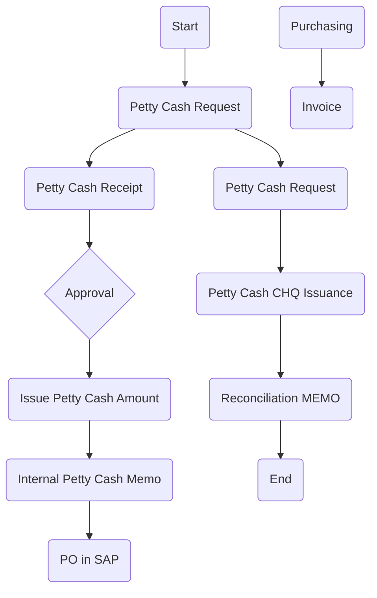

### Analysis of Flowchart

1. **Process Name**: Petty Cash Procurement

2. **Roles (Swimlanes)**:
   - Local Buyer
   - Procurement Manager
   - CFO / Finance
   - Supplier

3. **Steps Table**:

| Step # | Role                | Action                     | Next Step/Logic           |
|--------|---------------------|----------------------------|---------------------------|
| 1      | Procurement Manager | Start                      | Petty Cash Request        |
| 2      | Procurement Manager | Petty Cash Request         | Petty Cash Receipt        |
| 3      | Procurement Manager | Petty Cash Receipt         | Approval                  |
| 4      | Procurement Manager | Approval                   | Issue Petty Cash Amount   |
| 5      | Procurement Manager | Issue Petty Cash Amount    | Internal Petty Cash Memo  |
| 6      | Procurement Manager | Internal Petty Cash Memo   | PO in SAP                 |
| 7      | CFO / Finance       | Petty Cash Request         | Petty Cash CHQ Issuance   |
| 8      | CFO / Finance       | Petty Cash CHQ Issuance    | Reconciliation MEMO       |
| 9      | CFO / Finance       | Reconciliation MEMO        | End                       |
| 10     | Supplier            | Purchasing                 | Invoice                   |

4. **Mermaid.js Code Block**:

This representation captures the sequence of actions and decision points within the Petty Cash Procurement process flow.