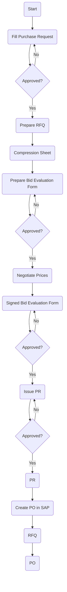

### Analysis of Flowchart

1. **Process Name**: Raw Material & Production Items

2. **Roles (Swimlanes)**:
   - Material/Item Requester
   - Department Manager
   - Procurement Officer
   - Procurement Manager/SC Director
   - FC/HOD/CFO/CEO
   - Supplier

3. **Steps in Markdown Table**:

| Step # | Role                              | Action                         | Next Step/Logic    |
|--------|-----------------------------------|--------------------------------|--------------------|
| 1      | Material/Item Requester           | Start                          | Step 2             |
| 2      | Material/Item Requester           | Fill Purchase Request          | Step 3             |
| 3      | Department Manager                | Approved?                      | Yes: Step 4 / No: Step 2 |
| 4      | Procurement Officer               | Prepare RFQ                    | Step 5             |
| 5      | Procurement Officer               | Compression Sheet              | Step 6             |
| 6      | Procurement Officer               | Prepare Bid Evaluation Form    | Step 7             |
| 7      | Procurement Manager/SC Director   | Approved?                      | Yes: Step 8 / No: Step 6 |
| 8      | Procurement Officer               | Negotiate Prices               | Step 9             |
| 9      | Procurement Officer               | Signed Bid Evaluation Form     | Step 10            |
| 10     | Department Manager                | Approved?                      | Yes: Step 11 / No: Step 9 |
| 11     | Procurement Officer               | Issue PR                       | Step 12            |
| 12     | FC/HOD/CFO/CEO                    | Approved?                      | Yes: Step 13 / No: Step 11 |
| 13     | Procurement Officer               | PR                             | Step 14            |
| 14     | Procurement Officer               | Create PO in SAP               | Step 15            |
| 15     | Supplier                          | RFQ                            | Step 16            |
| 16     | Supplier                          | PO                             | End                |

4. **Mermaid.js Code Block**:

This structured approach breaks down the steps clearly, defines roles, and traces each decision path precisely.