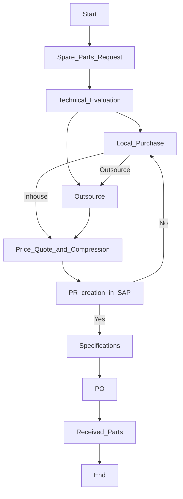

### Analysis of Flowchart

#### 1. Process Name:
- **Purchase Of Vehicle Spare Parts**

#### 2. Roles (Swimlanes):
- Spare Parts Requester
- Procurement Officer
- Procurement Manager/SC Director
- FC/HOD/CFO/CEO
- Supplier or Service Dealer

#### 3. Steps Table:

| Step # | Role                       | Action                        | Next Step/Logic    |
|--------|----------------------------|-------------------------------|--------------------|
| 1      | Spare Parts Requester      | Start                         | Step 2             |
| 2      | Spare Parts Requester      | Spare Parts Request           | Step 3             |
| 3      | Procurement Officer        | Technical Evaluation          | Step 4             |
| 4      | Procurement Officer        | Local Purchase                | Decision 1         |
| 5      | Procurement Officer        | Outsource                     | Step 8             |
| Decision 1 | Procurement Manager/SC Director | Inhouse Decision               | Step 6   Step 5 |
| 6      | Procurement Officer        | Price Quote & Compression     | Step 7             |
| 7      | FC/HOD/CFO/CEO             | PR creation in SAP            | Decision 2         |
| Decision 2 | FC/HOD/CFO/CEO             | Approved?                     | Step 10   Step 8|
| 8      | Procurement Officer        | PO                            | Step 9             |
| 9      | Procurement Officer        | Local Purchase                | Step 10            |
| 10     | Supplier or Service Dealer | Specifications                | Decision 2         |
| 11     | Supplier or Service Dealer | PO                            | Step 12            |
| 12     | Procurement Officer        | Received Parts                | Step 13            |
| 13     | Spare Parts Requester      | End                           |                    |

#### 4. Mermaid.js Code Block:

This Mermaid flowchart visually represents each step, including decision paths, showing the logical flow of the process.