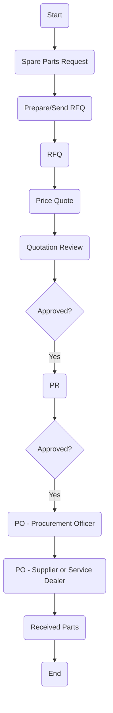

### Analysis

1. **Process Name**: Purchasing Consumable Spare Parts

2. **Roles (Swimlanes)**:
   - Technical Manager
   - Procurement Officer
   - Procurement Manager / SC Director
   - FC/HOD/CFO/CEO
   - Supplier or Service Dealer

3. **Steps Extraction**:

| Step # | Role                               | Action                 | Next Step/Logic        |
|--------|------------------------------------|------------------------|------------------------|
| 1      | Technical Manager                  | Start                  | Spare Parts Request    |
| 2      | Procurement Officer                | Spare Parts Request    | Prepare/Send RFQ       |
| 3      | Procurement Officer                | Prepare/Send RFQ       | RFQ                    |
| 4      | Supplier or Service Dealer         | RFQ                    | Price Quote            |
| 5      | Procurement Officer                | Price Quote            | Quotation Review       |
| 6      | Procurement Manager / SC Director  | Quotation Review       | Approved?              |
| 7      | Procurement Manager / SC Director  | Approved? (Yes)        | PR                     |
| 8      | Procurement Officer                | PR                     | Approved?              |
| 9      | FC/HOD/CFO/CEO                     | Approved? (Yes)        | PO (Procurement Officer) |
| 10     | Procurement Officer                | PO                     | PO (Supplier or Service Dealer) |
| 11     | Supplier or Service Dealer         | PO                     | Received Parts         |
| 12     | Procurement Officer                | Received Parts         | End                    |

4. **Mermaid.js Code Block**:

This flowchart outlines the process of purchasing consumable spare parts, covering roles from technical management to supplier interaction.