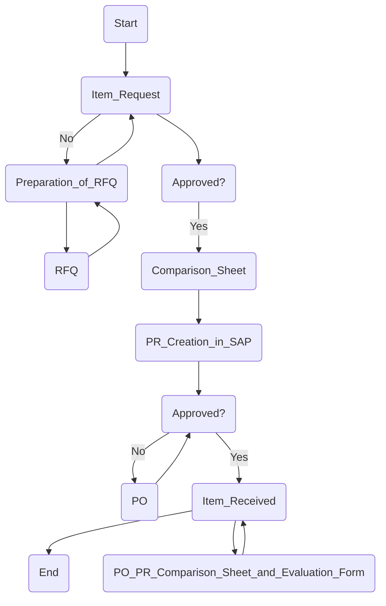

1. **Process Name**: Purchasing Departmental & Administration Items

2. **Roles (Swimlanes)**:
   - Item Requester
   - Procurement Officer
   - Procurement Manager/SC Director
   - FC/HOD/CF/G/CEO
   - Supplier or Service Dealer

3. **Markdown Table**:

| Step # | Role                          | Action                                | Next Step/Logic           |
|--------|-------------------------------|---------------------------------------|---------------------------|
| 1      | Item Requester                | Start                                 | 2                         |
| 2      | Procurement Officer           | Item Request                          | 3                         |
| 3      | Procurement Manager/SC Director | Approved?                           | Yes: 6, No: 2             |
| 4      | Procurement Officer           | Preparation of RFQ                    | 5                         |
| 5      | Supplier or Service Dealer    | RFQ                                   | 4                         |
| 6      | procurement Officer           | Comparison Sheet                      | 7                         |
| 7      | Procurement Officer           | PR Creation in SAP                    | 8                         |
| 8      | FC/HOD/CF/G/CEO               | Approved?                             | Yes: 10, No: 9            |
| 9      | Procurement Officer           | PO                                    | 8                         |
| 10     | Procurement Officer           | PO                                    | 11                        |
| 11     | FC/HOD/CF/G/CEO               | PO, PR Comparison Sheet & Evaluation Form | 12                  |
| 12     | Procurement Officer           | Received Item                         | 13                        |
| 13     | Item Requester                | End                                   | -                         |

4. **Mermaid.js Code Block**:

