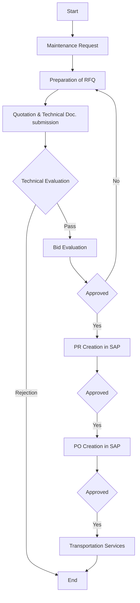

Sure! Here is the analysis based on the flowchart:

### 1. Process Name:
- **Outsourced Maintenance - Plant & Machines**

### 2. Roles (Swimlanes):
- Service Provider
- Requester
- Procurement Officer
- Procurement Manager / SC Director
- FC / HOD / CFO / CEO

### 3. Steps in Markdown Table:

| Step # | Role                             | Action                                   | Next Step/Logic          |
|--------|----------------------------------|------------------------------------------|--------------------------|
| 1      | Requester                        | Start                                    | Maintenance Request      |
| 2      | Requester                        | Maintenance Request                      | Preparation of RFQ       |
| 3      | Procurement Officer              | Preparation of RFQ                       | Quotation & Technical Doc. submission |
| 4      | Service Provider                 | Quotation & Technical Doc. submission    | Technical Evaluation     |
| 5      | Requester                        | Technical Evaluation                     | Pass: Bid Evaluation / Rejected: End |
| 6      | Procurement Officer              | Bid Evaluation                           | Approved: PR Creation in SAP |
| 7      | Procurement Manager / SC Director| Approved                                 | PR Creation in SAP       |
| 8      | Procurement Officer              | PR Creation in SAP                       | Approved: PO Creation in SAP |
| 9      | Procurement Manager / SC Director| Approved                                 | PO Creation in SAP       |
| 10     | Procurement Officer              | PO Creation in SAP                       | Approved: Transportation Services |
| 11     | Procurement Manager / SC Director| Approved                                 | Transportation Services  |
| 12     | Service Provider                 | Transportation Services                  | End                      |

### 4. Mermaid.js Code Block:

This provides a structured overview of the process, highlighting each step and decision points in the flowchart.