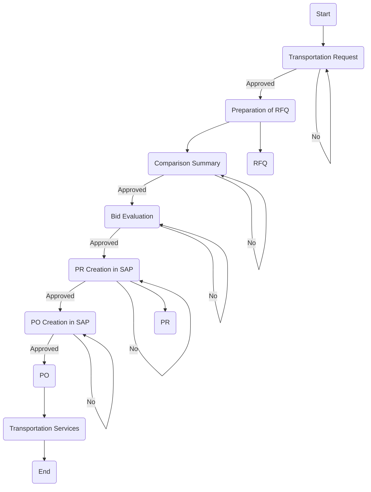

### Analysis of Flowchart

#### 1. Process Name:
- Logistics Service

#### 2. Roles (Swimlanes):
- Service Provider
- Requester
- Local Buyer/Procurement Officer
- Procurement Manager/S Director
- FC/HOD
- CEO/CFO

#### 3. Steps in Markdown Table:

```markdown
| Step # | Role                        | Action                  | Next Step/Logic |
|--------|-----------------------------|-------------------------|-----------------|
| 1      | Requester                   | Start                   | Step 2          |
| 2      | Local Buyer/Procurement Officer | Transportation Request   | Approval 1      |
| 3      | Local Buyer/Procurement Officer | Preparation of RFQ      | Step 4          |
| 4      | Local Buyer/Procurement Officer | Comparison Summary      | Approval 2      |
| 5      | Local Buyer/Procurement Officer | Bid Evaluation          | Approval 3      |
| 6      | Local Buyer/Procurement Officer | PR Creation in SAP      | Approval 4      |
| 7      | Local Buyer/Procurement Officer | PO Creation in SAP      | Approval 5      |
| 8      | Requester                   | RFQ                     | Step 3          |
| 9      | Requester                   | PR                      | Step 6          |
| 10     | Service Provider            | PO                      | Step 11         |
| 11     | Service Provider            | Transportation Services | End             |

Approvals:
| Approval # | Role                          | Action        | Next Step Yes | Next Step No |
|------------|-------------------------------|---------------|---------------|--------------|
| 1          | Procurement Manager/S Director| Approved      | Step 3        | Step 2       |
| 2          | Procurement Manager/S Director| Approved      | Step 5        | Step 4       |
| 3          | Procurement Manager/S Director| Approved      | Step 6        | Step 5       |
| 4          | FC/HOD                        | Approved      | Step 7        | Step 6       |
| 5          | CEO/CFO                       | Approved      | Step 10       | Step 7       |
```

#### 4. Logic as Mermaid.js Code Block:


