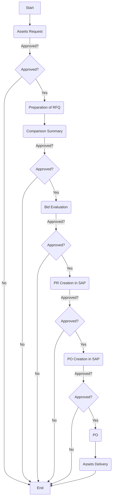

Here’s the analysis of the flowchart:

### 1. Process Name
- Assets & CAPEX

### 2. Roles (Swimlanes)
- Service Provider
- Requester
- Local Buyer/Procurement Officer
- Procurement Manager/S Director
- FC/HOD
- CEO/CFO

### 3. Markdown Table of Steps

| Step # | Role                                | Action                | Next Step/Logic          |
|--------|-------------------------------------|-----------------------|--------------------------|
| 1      | Requester                           | Start                 | Assets Request           |
| 2      | Local Buyer/Procurement Officer     | Assets Request        | Approved?                |
| 3      | Procurement Manager/S Director      | Approved?             | Yes: Preparation of RFQ / No: End |
| 4      | Local Buyer/Procurement Officer     | Preparation of RFQ    | Comparison Summary       |
| 5      | Local Buyer/Procurement Officer     | Comparison Summary    | Approved?                |
| 6      | Procurement Manager/S Director      | Approved?             | Yes: Bid Evaluation / No: End     |
| 7      | Local Buyer/Procurement Officer     | Bid Evaluation        | Approved?                |
| 8      | Procurement Manager/S Director      | Approved?             | Yes: PR Creation in SAP / No: End |
| 9      | Local Buyer/Procurement Officer     | PR Creation in SAP    | Approved?                |
| 10     | FC/HOD                              | Approved?             | Yes: PO Creation in SAP / No: End |
| 11     | Local Buyer/Procurement Officer     | PO Creation in SAP    | Approved?                |
| 12     | CEO/CFO                             | Approved?             | Yes: PO / No: End        |
| 13     | Service Provider                    | PO                    | Assets Delivery          |
| 14     | Service Provider                    | Assets Delivery       | End                      |

### 4. Mermaid.js Code Block

This structure follows the decision flow and makes clear distinctions where approvals are required.