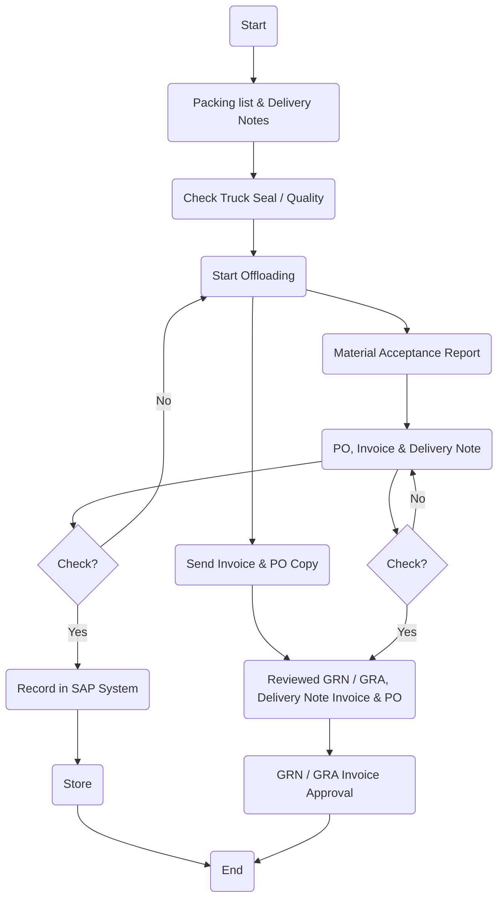

Sure, let's analyze the flowchart provided.

### 1. Process Name

Receiving & Storage of Support Material, Parts & Equipment

### 2. Roles (Swimlanes)

- Driver
- DC Officer / Warehouse In-Charge / WH Head
- Procurement Officer
- Quality Department / Requesting Dept. Manager
- Finance Department

### 3. Steps in Markdown Table

| Step # | Role                                    | Action                                            | Next Step/Logic                                     |
|--------|-----------------------------------------|---------------------------------------------------|-----------------------------------------------------|
| 1      | Driver                                  | Start                                             | 2                                                   |
| 2      | DC Officer / Warehouse In-Charge / WH Head | Packing list & Delivery Notes                      | 3                                                   |
| 3      | DC Officer / Warehouse In-Charge / WH Head | Check Truck Seal / Quality                         | 4                                                   |
| 4      | DC Officer / Warehouse In-Charge / WH Head | Start Offloading                                   | 5, 6                                                |
| 5      | Procurement Officer                     | Send Invoice & PO Copy                             | 8                                                   |
| 6      | DC Officer / Support Material WH Head   | Material Acceptance Report                         | 7                                                   |
| 7      | Quality Department / Requesting Dept. Manager | PO, Invoice & Delivery Note                        | 9                                                   |
| 8      | Quality Department / Requesting Dept. Manager | Check? (Yes/No)                                    | Yes: 10, No: 4                                      |
| 9      | Quality Department / Requesting Dept. Manager | Check? (Yes/No)                                    | Yes: 11, No: 8                                      |
| 10     | DC Officer / Support Material WH Head   | Record in SAP System                               | 12                                                  |
| 11     | Finance Department                      | Reviewed GRN / GRA, Delivery Note Invoice & PO     | 13                                                  |
| 12     | DC Officer / Support Material WH Head   | Store                                              | End                                                 |
| 13     | Finance Department                      | GRN / GRA Invoice Approval                         | End                                                 |

### 4. Logic in Mermaid.js Code Block

This analysis includes the process name, roles involved, a detailed breakdown of each step, and the logic flow depicted using Mermaid.js.