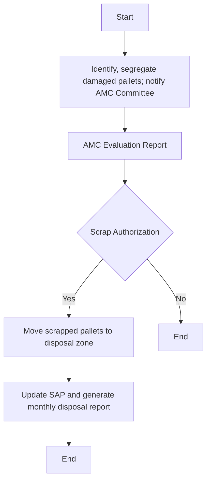

Sure! Here is the analysis of the flowchart:

### 1. Process Name
Handling Wooden & Plastic Pallets (Disposal Plastic Pallet)

### 2. Roles (Swimlanes)
- DC Officer / WH Head
- AMC Committee
- Warehouse Team
- Reporting/System Team

### 3. Steps in Markdown Table

| Step # | Role                  | Action                                         | Next Step/Logic                         |
|--------|-----------------------|-----------------------------------------------|-----------------------------------------|
| 1      | DC Officer / WH Head  | Identify, segregate damaged pallets; notify AMC Committee. | Step 2                                  |
| 2      | AMC Committee         | AMC Evaluation Report                         | Scrap Authorization                     |
| 3      | AMC Committee         | Scrap Authorization                           | Yes: Step 4 / No: End                   |
| 4      | Warehouse Team        | Move scrapped pallets to disposal zone.       | Step 5                                  |
| 5      | Reporting/System Team | Update SAP and generate monthly disposal report. | End                                     |

### 4. Logic as Mermaid.js Code Block

This captures the process and logic flow of handling the disposal of plastic pallets according to the given flowchart.