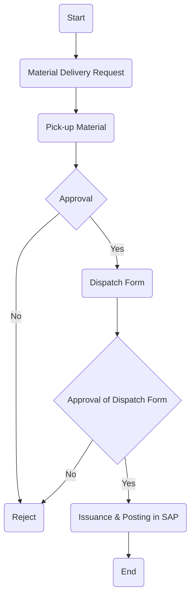

### Analysis of Flowchart

#### 1. Process Name:
Dispatching of Production Support Materials, Spare Parts, and Equipment.

#### 2. Roles (Swimlanes):
- HOD
- DC Officer / WH Shelf Organizer / WH Manager
- Production Manager / Quality Department Manager
- Warehouse Section Head

#### 3. Steps in Markdown Table:

| Step # | Role                                          | Action                            | Next Step/Logic                     |
|--------|-----------------------------------------------|-----------------------------------|-------------------------------------|
| 1      | HOD                                           | Start                             | Step 2                              |
| 2      | DC Officer / WH Shelf Organizer / WH Manager  | Material Delivery Request         | Step 3 or Reject                    |
| 3      | DC Officer / WH Shelf Organizer / WH Manager  | Pick-up Material                  | Step 4                              |
| 4      | Production Manager / Quality Department Manager | Approval                           | Yes: Step 5, No: Reject             |
| 5      | Warehouse Section Head                        | Dispatch Form                     | Step 6                              |
| 6      | Warehouse Section Head                        | Approval of Dispatch Form         | Yes: Step 7, No: Reject             |
| 7      | DC Officer / WH Shelf Organizer / WH Manager  | Issuance & Posting in SAP         | Step 8                              |
| 8      | DC Officer / WH Shelf Organizer / WH Manager  | End                               | -                                   |

#### 4. Logic as Mermaid.js Code Block:

This Mermaid.js code captures the flow and decision points as represented in the flowchart, with explicit paths for approvals and rejections.