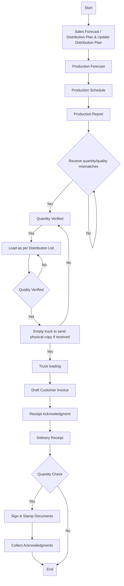

Sure, here is the analysis of the flowchart:

### 1. Process Name
- Inbound & Outbound of Flour / Bran and Animal Feed as Finished Goods

### 2. Roles (Swimlanes)
- Sales
- Head of Maintenance / Maintenance Manager
- Production Manager / AG. Officer
- FG Warehouse Manager
- Quality Dept. Manager
- DC Officer
- Sales Rep.
- Driver
- Distributor / Customer Stores

### 3. Steps in Markdown Table

| Step # | Role                        | Action                                                               | Next Step/Logic                      |
|--------|-----------------------------|----------------------------------------------------------------------|--------------------------------------|
| 1      | Sales                       | Start                                                                | Step 2                               |
| 2      | Sales                       | Sales Forecast / Distribution Plan & Update Distribution Plan | Step 3                               |
| 3      | Head of Maintenance/Manager | Production Forecast                                                  | Step 4                               |
| 4      | Production Manager/AG. Officer | Production Schedule                                                  | Step 5                               |
| 5      | FG Warehouse Manager        | Production Report                                                   | Step 6                               |
| 6      | Quality Dept. Manager       | Receive quantity/quality mismatches                                 | Step 7 - Quantity Verified           |
| 7      | Quality Dept. Manager       | Quantity Verified                                                   | Yes: Step 8, No: Step 6              |
| 8      | FG Warehouse Manager        | Load as per Distribution List                                       | Step 9                               |
| 9      | Quality Dept. Manager       | Quality Verified                                                    | Yes: Step 10, No: Step 8             |
| 10     | DC Officer                  | Empty truck to send physical copy if received                       | Yes: Step 11, No: Step 7            |
| 11     | DC Officer                  | Truck loading                                                       | Step 12                              |
| 12     | Sales Rep.                  | Draft Customer Invoice                                              | Step 13                              |
| 13     | Sales Rep.                  | Receipt Acknowledgment                                              | Step 14                              |
| 14     | Driver                      | Delivery Receipt                                                    | Step 15                              |
| 15     | Distributor/Customer Stores | Quantity Check                                                      | Yes: Step 16, No: End                |
| 16     | Distributor/Customer Stores | Sign & Stamp Documents                                              | Step 17                              |
| 17     | Distributor/Customer Stores | Collect Acknowledgments                                             | End                                  |

### 4. Mermaid.js Code Block

This should provide a clear translation of the flowchart into structured logic.